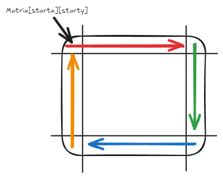
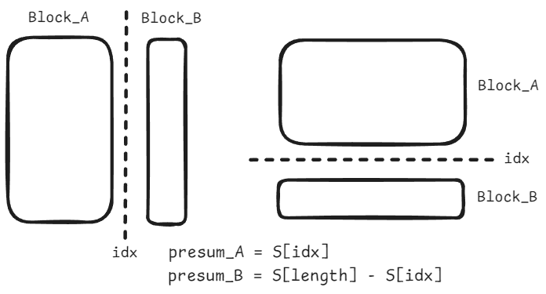

## 滑动窗口-最小子数组

[209.长度最小的子数组](https://leetcode-cn.com/problems/minimum-size-subarray-sum/description/)

首先解决这个问题最简单的方法就是暴力求解。

使用两个循环，外层循环遍历数组，内层循环计算以当前元素为起点的子数组和。然后比较子数组和是否大于等于目标值，如果是则更新最小长度。
```cpp
int minSubArrayLen(int target, vector<int>& nums) {
        // 一般解法, 超时
        int ans = INT_MAX;
        int n = nums.size() - 1;
        for (int i = 0; i <=  n; i++) {
            int sum = 0;
            for (int j = i; j <= n; j++){
                sum += nums[j];
                if (sum >= target) {
                    ans = min(ans, (j-i+1));
                    break; //即使提前中断内循环，时间复杂度也是O(n^2)，结果上来说还是超时
                }
            }
        }
        return ans == INT_MAX ? 0 : ans;
    }
```

:::note[滑动窗口]
滑动窗口的思路是维护一个窗口，使得窗口内的元素和满足某种条件。
:::
在这个问题中，实现滑动窗口需要考虑三个问题：
1. 滑动窗口内是什么
    - 窗口其实就是满足条件(`subArraySum >= target`)的一段区间。
2. 如何移动滑动窗口的起始位置
    - 如果当前窗口的值大于等于`target`了，窗口就要向前移动了（也就是该缩小了）。
3. 如何移动滑动窗口的结束位置
    - 窗口的结束位置就是遍历数组的指针，也就是循环里的`end`索引

而关键在于如何移动窗口的起始位置：
```cpp
while (sum >= target) { 
    // 每次加入新元素后，检查 sum 是否大于等于目标值 s。如果是，则计算当前子数组的长度，
    //并与已记录的最小长度进行比较，取较小值。
    //然后，移动起始指针 i，并从 sum 中减去 nums[i]，以缩小窗口，直到 sum 小于 s
    //随后start向前移动一位
    subLength = end - start  + 1;
    ans = min(ans, subLength); 
    sum -= nums[start++]; 
}
```

滑动窗口的过程，其实类似向前蠕动的蛇，每次向前移动一格，然后检查是否满足条件，满足条件则记录当前窗口的长度，然后继续向前移动。

完整的代码如下：
```cpp
int minSubArrayLen(int target, vector<int>& nums) {
        // 使用滑动窗口
        int sum = 0;
        int ans = INT_MAX;
        int start = 0, end = 0; //滑动窗口的起始和终止位置
        int subLength = 0; //滑动窗口的长度
        while (end < nums.size()) { // 移动结束指针，将nums[end]加入子数组
            sum += nums[end];
            while (sum >= target) { //注释如上
                subLength = end - start  + 1;
                ans = min(ans, subLength); 
                sum -= nums[start++]; 
            }
            end++; //使用的while的写法，最后要将end++
        }
        return ans == INT_MAX? 0 : ans;
    }
```
:::tip[时间复杂度]
在滑动窗口方法中，每个元素最多被访问两次（一次被右指针访问，另一次被左指针访问），因此时间复杂度为 O(n)。
:::

## 螺旋矩阵
[54.螺旋矩阵](https://leetcode-cn.com/problems/spiral-matrix/)

[59.螺旋矩阵II](https://leetcode-cn.com/problems/spiral-matrix-ii/)

随想录里面讲到的题目是59.螺旋矩阵II，本质上是同一个类型，59只是将一般矩阵换成了方阵，都是了解循环的边界处理条件。

这里我将两题都做了，然后以54.螺旋矩阵为例，以及这种题的两种思路。

### 1. **随想录中的思路**

要模拟螺旋矩阵的遍历，就是从四个方向：
- 遍历上行从左到右
- 遍历右列从上到下
- 遍历下行从右到左
- 遍历左列从下到上

如图所示：


<!--  -->

在这里，对于每一次遍历，都是最后一个元素不处理，留给下一次遍历处理，这也是坚持了每条边左闭右开的原则。

由于在螺旋遍历过程中，每次遍历都会缩小矩阵的范围。当行数和列数的差值为奇数时，最终可能会剩下一行或一列未被遍历，因此也许要对这集中情况进行处理。

在59.螺旋矩阵II中，只是将矩阵换成了方阵，因此最多只会出现剩余一个元素的情况。
依照随想录给出的思路：
```cpp
vector<int> spiralOrder(vector<vector<int>>& matrix) {
    int startx = 0, starty = 0;
    int m = matrix.size();
    int n = matrix[0].size();
    int loop = min(m, n) / 2;
    int offset = 1;
    int i, j;
    vector<int> ans;
    while (loop--) {
        i = startx;
        j = starty;
        for (j = starty; j < n - offset; j++) ans.push_back(matrix[i][j]); //记录当前循环上面的行          
        for (i = startx; i < m - offset; i++) ans.push_back(matrix[i][j]); //记录当前循环右边的列    
        for ( ; j > starty; j--) ans.push_back(matrix[i][j]); //记录当前循环下面的行 
        for( ; i > startx; i--) ans.push_back(matrix[i][j]); //记录当前循环左边的列
        startx++;
        starty++;
        offset++;
    }
        // 如果循环次数是奇数，那么需要把中间的元素加入结果
    if (min(m, n) % 2 == 1) {
        if (m < n) {
            // 中间剩余一行
            for (j = starty; j < n - starty; j++) {
                ans.push_back(matrix[startx][j]);
            }
        } else if (m > n) {
            // 中间剩余一列
            for (i = startx; i < m - startx; i++) {
                ans.push_back(matrix[i][starty]);
            }
        } else {
            // 中间剩余一个元素
            ans.push_back(matrix[startx][starty]);
        }
    }
    return ans;
}
```
### 2. **逐层模拟**

我们可以通过定义上下左右四个边界来模拟螺旋矩阵的遍历。确保了对所有情况的处理，包括奇数维度的矩阵。

1. 初始化边界：定义 left、right、top、bottom 四个变量，分别表示当前层的左、右、上、下边界。

2. 循环遍历：在 left <= right 且 top <= bottom 的条件下，进行以下操作：

    - 从左到右遍历上边界：从 left 到 right，将元素添加到结果中。

    - 从上到下遍历右边界：从 top + 1 到 bottom，将元素添加到结果中。

    - 从右到左遍历下边界（需要确保当前层至少有两行两列）：从 right - 1 到 left，将元素添加到结果中。

    - 从下到上遍历左边界（需要确保当前层至少有两行两列）：从 bottom - 1 到 top + 1，将元素添加到结果中。

3. 缩小边界：在完成一层的遍历后，缩小边界范围，进入下一层的遍历。

实现如下：
```cpp
vector<int> spiralOrder(vector<vector<int>>& matrix) {
    vector<int> ans;
    int m = matrix.size(), n = matrix[0].size();

    int left = 0, right = n - 1, top = 0, bottom = m - 1; // 定义上下左右边界，逐层遍历

    while (left <= right && top <= bottom) { //当对应边界还未交错时，进行处理
        // 列j: 从左边界处理到右边界，行此时为上边界top
        for (int j = left; j <= right; ++j) ans.push_back(matrix[top][j]);
        // 行i: 从上边界处理到下边界，列此时为右边界right
        // 因为上边界处理完，所以i=top+1
        for (int i = top + 1; i <= bottom; ++i) ans.push_back(matrix[i][right]);

        if (left < right && top < bottom) { // 当矩阵至少拥有两行两列时，处理逻辑与上右不一样
            // 列j：从右边界处理到左边界，行此时为下边界bottom
            //因为右边界处理完，所以j = right - 1，同时不访问左下角元素
            for (int j = right - 1; j > left; --j) ans.push_back(matrix[bottom][j]);
            // 行i：从下边界处理到上边界，列此时为左边界left
            for (int i = bottom; i > top; --i) ans.push_back(matrix[i][left]);
        }
        ++left; --right; ++top; --bottom; //处理边界
    }
    return ans; 
}
```
:::important[边界处理]
与随想录中不同的是，在这种处理方法中，处理下边界和左边界的循环条件与上边界和右边界的循环条件有所不同，主要原因在于避免重复访问元素。
:::

## 区间和

[kamacoder-58.区间和](https://kamacoder.com/problempage.php?pid=1070)

这里涉及到的一个数据中的技巧：前缀和(Prefix Sum)。


:::note[前缀和（Prefix Sum）简介]
前缀和是一种用于高效计算**子数组区间和**的数据结构。它的核心思想是**预先计算数组的前缀和数组**，然后通过**O(1) 时间复杂度**查询任意区间的和。
:::

### 1. **前缀和的定义**
对于一个数组 `A` ，定义其前缀和数组 `S`：

`S[i] = A[0] + A[1] + ... + A[i-1]`


其中：
- `S[i]` 表示从索引 `0` 到索引 `i-1` （不含 `i` ）的元素总和。
- 通过前缀和，可以 快速求解子数组`[L, R]`的和：
    `SUM(L, R) = S[R+1] - S[L]`

这样，计算 **任意区间和** 仅需 **O(1)** 时间，而不是直接遍历数组求和的 **O(n)**。

### 2. **计算前缀和**
 **(1) 构建前缀和数组**
```cpp
#include <iostream>
#include <vector>
using namespace std;

vector<int> computePrefixSum(const vector<int>& A) {
    int n = A.size();
    vector<int> S(n + 1, 0); // S[0] = 0，保证计算区间时不会越界
    for (int i = 1; i <= n; i++) {
        S[i] = S[i - 1] + A[i - 1]; // S[i] 存储 A[0] 到 A[i-1] 的和
    }
    return S;
}
```
时间复杂度：`O(n)`

**(2) 快速计算区间和**
```cpp
int rangeSum(const vector<int>& S, int L, int R) {
    return S[R + 1] - S[L]; // O(1) 计算子数组 [L, R] 的和
}
```
**示例：**
```cpp
int main() {
    vector<int> A = {2, 3, 5, 7, 11, 13};
    vector<int> S = computePrefixSum(A);

    cout << "Sum of A[1] to A[3]: " << rangeSum(S, 1, 3) << endl; // 3 + 5 + 7 = 15
    cout << "Sum of A[2] to A[5]: " << rangeSum(S, 2, 5) << endl; // 5 + 7 + 11 + 13 = 36
}

Output:
Sum of A[1] to A[3]: 15
Sum of A[2] to A[5]: 36
```
**时间复杂度：**
- **预处理**（计算前缀和）：`O(n)`
- **查询区间和**：`O(1)`
<!-- 
## **3. 典型应用**
### **(1) 计算多个区间和**
前缀和非常适合**多次求区间和**的情况，例如：
- 给定 `Q` 组查询，每次查询一个区间的和，时间复杂度可优化为 \( O(Q) \)（而不是 \( O(Q \cdot N) \)）。

### **(2) 计算一维数组的差分**
**差分数组**用于快速对一个区间 `[L, R]` 进行加/减操作：
- **前缀和** 和 **差分数组** 是互逆的：
  - **前缀和** 用于**快速求和**。
  - **差分数组** 用于**快速修改区间值**（如区间加法操作）。

### **(3) 二维前缀和**
适用于 **二维矩阵的子矩形区域和** 查询，公式：
\[
S[i][j] = A[0][0] + \dots + A[i-1][j-1]
\]
可以用来优化查询矩阵的子矩形和，时间复杂度降低到 \( O(1) \)。

 -->

需要注意的就是这里的前缀和数组的长度是`n+1`，因为`S[0] = 0`，这样可以保证计算区间和时不会越界，这一点与kamacode中的解法有些区别。

## 开发商购买土地问题
[kamacoder-44.开发商购买土地](https://kamacoder.com/problempage.php?pid=1044)

这里其实也是一个可以使用前缀和来解决问题，对于我来说前缀和的思路可能更好理解。关键就是无论对于哪种分割方向来说，都是是找到一个index，使得区间`[0, index]`的总和与区间`(index, L]`的总和差值最小。


代码写的有些冗长，但是思路是清晰的。

```cpp
#include <climits>
#include <iostream>
#include <vector>
using namespace std;

int main() {
  int n, m;
  cin >> n >> m;
  // 初始化矩阵
  vector<vector<int>> vec(n, vector<int>(m, 0));
  for (int i = 0; i < n; i++) {
    for (int j = 0; j < m; j++) {
      cin >> vec[i][j];
    }
  }
    // 计算横向总和
    vector<int> total_h(n, 0);
    for (int i = 0; i < n; i++) {
        for (int j = 0; j < m; j++) {
            total_h[i] += vec[i][j];
        }
    }
    // 计算横向前缀和
    vector<int> p_h(n + 1, 0);
    for (int i = 1; i <= n; i++) {
        p_h[i] = p_h[i - 1] + total_h[i - 1];
    }
    // 计算纵向总和
    vector<int> total_v(m, 0);
    for (int j = 0; j < m; j++) {
        for (int i = 0; i < n; i++) {
            total_v[j] += vec[i][j];
        }
    }
    // 计算纵向前缀和
    vector<int> p_v(m + 1, 0);
    for (int i = 1; i <= m; i++) {
        p_v[i] = p_v[i - 1] + total_v[i - 1];
    }
  // 无论对于哪种分割方向来说，都是是找到一个index，使得区间[0, index]的总和与区间(index, L]的总和差值最小。
  int ans = INT_MAX;
  int block_A, block_B;
  // 对于横向
  for (int idx = 1; idx < n; idx++) {
    // 分给A
    block_A = p_h[idx];
    // 分给B
    block_B = p_h[n] - p_h[idx];
    ans = min(ans, abs(block_A - block_B));
  }
  // 对于纵向
  for (int idx = 1; idx < m; idx++) {
    // 分给A
    block_A = p_v[idx];
    // 分给B
    block_B = p_v[m] - p_v[idx];
    ans = min(ans, abs(block_A - block_B));
  }
  cout << ans << endl;
}
```

这里需要注意的是
<!-- ```cpp
block_A = p_h[idx]; // 其实这里的内容是p_h[idx] - p_h[0], 由于p_h[0] = 0，所以这里可以直接写成p_h[idx]
block_B = p_h[n] - p_h[idx];
```
这里的`p_h[n]`是整个矩阵的和，`p_h[idx]`是前`idx`行的和，所以`p_h[n] - p_h[idx]`就是剩下的行的和。
也就是说，`p_h[idx]`只属于A，而不会同时算入B。 -->

以横向为例，在计算的过程中，我们使用了下面的方法来计算前缀和：
```cpp
for (int i = 1; i <= n; i++) {
    p_h[i] = p_h[i - 1] + total_h[i - 1];
}
```

假设 `idx=2`，那么：

- `p_h[2] = total_h[0] + total_h[1]`
- `block_A = p_h[2] - p_h[0]` -> A 包含第 0, 1 行
- `block_B = p_h[n] - p_h[2]` -> B 包含第 2, 3, ..., n-1 行

```cpp
p_h[n] = total_h[0] + total_h[1] + total_h[2] + ... + total_h[n-1];
p_h[n] - p_h[2] = total_h[2] + total_h[3] + ... + total_h[n-1];
```
**B 仅包含 idx 及之后的行（即 从 `idx` 开始到 `n-1`）。**

弄清楚了前缀和的下标问题，其实就很好理解了。

## 总结

今天的内容说实话有点多，滑动窗口的应用，螺旋矩阵的遍历，以及前缀和的应用。

- 滑动窗口通过动态调整子数组的范围，可以有效解决子数组问题，如最小子数组和。
- 螺旋矩阵的遍历方法包括模拟四个方向的移动和逐层缩小边界，确保了矩阵所有元素的正确访问，需要注意的是边界的处理。
- 前缀和作为高效计算区间和的技巧，能够在 O(1) 时间内查询子数组和，并用于优化矩阵分割问题，如开发商购买土地问题。

其实还有很多相关题没看，等到有时间再自己看看吧。

摸了摸了摸了！