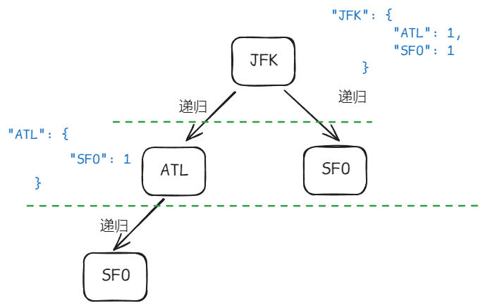

## 重新安排行程

[332. 重新安排行程](https://leetcode-cn.com/problems/reconstruct-itinerary/)

题意：现在我们一堆「机票」，每张机票都是一个 出发机场 -> 到达机场，比如 ["JFK", "SFO"] 表示从 JFK 飞到 SFO。

要求你用所有机票安排一个「完整的行程」，而且：

1. 必须从 "JFK" 出发。

2. 如果有多种行程方案可以使用完所有机票，就选字典序最小的那个（比如 A < B < C...）。

这本质是一个 **图的欧拉路径问题**（所有边恰好走一次），并结合了 字典序优先遍历（DFS + 小顶堆）：

- 把机票变成一张图（邻接表），从出发点 "JFK" 开始 DFS。

- 每次从当前机场出发，优先访问「按字典序最小」的下一站。

- 回溯构建路径。

### 使用回溯 + map映射

首先我们要构建机场的和机场-机票的映射关系，这里我们可以使用 `unordered_map` 来存储机场和各机场的机票数量的关系。

各机场的机票数量可以使用 `map<string, int>` 来存储，`key` 为机场名，`value` 为机票数量。

所以我们的这个映射关系可以使用 `unordered_map<string, map<string, int>>` 来存储。

```cpp
unordered_map<string, map<string, int>> targets;

// 初始化target
for (auto& ticket : tickets) {
    targets[ticket[0]][ticket[1]]++;
}
```

```json
targets[出发机场][到达机场] = 这条航线剩余多少张票

例如：tickets = [["JFK", "ATL"], ["JFK", "SFO"], ["ATL", "SFO"]]

初始化之后会变成：

targets = {
    "JFK": {
        "ATL": 1,
        "SFO": 1
    },
    "ATL": {
        "SFO": 1
    }
}

```
之后是回溯函数的实现，回溯函数的参数为：

```cpp
bool backTacking(int ticketNum, vector<string>& path)

- ticketNum：表示当前已经使用的机票数量
- path：表示当前的路径

回溯函数的返回值为 bool，表示是否找到了一条完整的路径。
```

回溯的终止条件：

```cpp
if (ticketNum + 1== path.size()) {
    return true;
}

当机票数量加1等于搜索的路径长度时，说明找到了完整的路径。换一种说法就是找到了一条欧拉路径。
假如最后我们的路径是：["JFK", "SFO", "ATL"]，那么机票数量 ticketNum = 2，路径长度 path.size() = 3。
```

单层搜索的逻辑：

```cpp
for (auto& target : targets[path.back()]) {
    // path.back(): path中的最后一个元素，也就是当前遍历到的机场
    // target[path.back()]: 当前机场的每条航线和机票数量，也就是遍历当前机场的每条航线
    // type(tar[path.back()]): map<string, int>
    if (target.second > 0) { // 如果遍历的当前航线机票还有剩余
        path.push_back(target.first); // 选择目的地，加入到path中
        target.second--; // 机票数量 - 1
        if (backTacking(ticketNum, path)) return true; // 如果递归刚加入的机场返回true，则继续向上返回
        target.second++; // 回溯 机票数量 + 1
        path.pop_back(); // 撤销目的地选择
    }
}
```

这里我们以初始化后的targets为例，可以有以下树状图：

```cpp
targets = {
    "JFK": {
        "ATL": 1,
        "SFO": 1
    },
    "ATL": {
        "SFO": 1
    }
}
```


整体代码如下：

```cpp
class Solution {
private:
    unordered_map<string, map<string, int>> targets;
    vector<string> ans;

    bool backTacking(int ticketNum, vector<string>& path) {
        if (ticketNum + 1 == path.size()) { // 如果机票数量 + 1 == 机场数量，说明找到了一条可行的路径，也就是找到了一条欧拉路径
            return true;
        }
        for (auto& target : targets[path.back()]) {
            // path.back(): path中的最后一个元素，也就是当前遍历到的机场
            // target[path.back()]: 当前机场的每条航线和机票数量，也就是遍历当前机场的每条航线
            // type(tar[path.back()]): map<string, int>
            if (target.second > 0) { // 如果遍历的当前航线机票还有剩余
                path.push_back(target.first); // 选择目的地
                target.second--; // 机票数量 - 1
                if (backTacking(ticketNum, path)) return true; // 如果递归刚加入的机场返回true，则继续向上返回
                target.second++; // 回溯 机票数量 + 1
                path.pop_back(); // 撤销目的地选择
            }
        }
        return false; // 否则返回false，说明没有找到
    }
public:
    vector<string> findItinerary(vector<vector<string>>& tickets) {
        targets.clear();
        ans.clear();
        // 初始化targets
        for (const auto ticket : tickets) {
            // 初始化unordered_map
            // ticket[0]: 机场名
            // ticket[1]: 该机场对应的航班以及机票数量，是一个map<string, int>
            // 相当于从初始化有向图
            targets[ticket[0]][ticket[1]]++;
        }
        ans.push_back("JFK");
        backTacking(tickets.size(), ans);
        return ans;
    }
};
```

### 使用链表 + 优先级队列

这种做法其实是基于有向图的 DFS + 小顶堆（优先级队列）来实现的。属于是一种 **Hierholzer 算法**的变种，用来找欧拉路径，但加入了一个要求：每次访问字典序最小的边。

Hierholzer 算法主要思路是：

- 在图中从起点开始一路走下去，每次都选择字典序最小的下一站，走完一条路径后“回溯地插入”路径到最终结果中。

数据结构的选择：

```cpp
// 使用优先队列来存储每个机场的目的地
unordered_map<string, priority_queue<string, vector<string>, greater<string>>> graph;
```

- `key` 是出发机场

- `value` 是一个小顶堆（优先队列），每次能快速拿到字典序最小的目的地

它的含义是：建立一个从出发机场 `string` 到多个目的地 `string` 的映射，并且这些目的地是按字母排序的优先级队列（小顶堆），这样可以随时快速找到“字典序最小的下一个目的地”。

第一层：

```cpp
unordered_map<string, ...>
```

- 这是一张哈希表（无序 map），
- key 是 出发机场（比如 "JFK"、"LHR" 等）；
- value 是从这个机场出发所能到达的所有机场的集合（你要用优先队列来维护这些目的地）。

第二层：

```cpp
priority_queue<string, vector<string>, greater<string>>
```

这是 C++ 的 小顶堆写法，它的含义是：一个会自动维护“字典序最小”的字符串在队首的优先队列。

默认 `priority_queue` 是大顶堆，也就是“最大的在前面”
所以我们要自己写成小顶堆（最小字母在前）：

- `vector<string>` 是底层容器

- `greater<string>` 是比较函数（实现小顶堆）

```cpp
// 优先级队列数据结构预览
graph["JFK"] = {"ATL", "SFO", "LHR"} // 自动按字母顺序管理
graph["LHR"] = {"SFO"}
````

---

```cpp
/// 使用链表来保存最终结果
list<string> itinerary;
```
使用链表 `list` 来保存最终结果，方便在路径前面插入（从后往前构建路径）

深度优先搜索（DFS）过程：

```cpp
// Hierholzer 算法的 DFS 过程
void dfs(const string& airport) {
        auto& pq = graph[airport]; // 引用当前机场对应的优先队列
        // 当还有目的地没访问时，一直往下走
        while (!pq.empty()) {
            string next = pq.top(); // 拿出字典序最小的目的地
            pq.pop(); // 模拟用掉这张票
            dfs(next); // 递归访问下一个目的地
        }
        // 所有路径走完后，把当前节点插到最前面
        itinerary.push_front(airport); // 回溯插入
    }
```

最后整体的代码如下：

```cpp
class Solution {
private:
   // 图结构：每个出发地 -> 所有目的地的小顶堆（按字母排序）
   unordered_map<string, priority_queue<string, vector<string>, greater<string>>> graph;

   // 用链表保存最终行程，方便在前面插入（欧拉路径是回溯构建的）
   list<string> itinerary;

   // 深度优先遍历构建行程
    void dfs(const string& airport) {
        // 引用当前机场对应的优先队列
        auto& pq = graph[airport];

        // 当还有目的地没访问时，一直往下走
        while (!pq.empty()) {
            string next = pq.top(); // 拿出字典序最小的目的地
            pq.pop();               // 模拟用掉这张票
            dfs(next);              // 递归访问下一站
        }

        // 所有路径走完后，把当前节点插到最前面
        itinerary.push_front(airport);  // 回溯时构建路径
    }
public:
    vector<string> findItinerary(vector<vector<string>>& tickets) {
        // 构建图
        for (const auto& ticket : tickets) {
            graph[ticket[0]].push(ticket[1]); // 加入小顶堆
        }

        // 从 JFK 出发执行 DFS
        dfs("JFK");

        // 把链表转换成 vector 输出结果
        return vector<string>(itinerary.begin(), itinerary.end());
    }
};
```
整体的思想：

用一个“出发机场 → 小顶堆目的地”的图结构，配合 Hierholzer 算法从 "JFK" 出发递归走图，每次优先访问字典序最小的目的地，构建出字典序最小的欧拉路径。

| 步骤 | 做的事情 | 用到的结构 |
|------|-----------|------------|
| 1️ | 把机票构造成一张**有向图** | `unordered_map<string, 优先级队列(小顶堆)>` |
| 2️ | 用 DFS 找一条「覆盖所有边」的路径（Hierholzer 算法） | 递归 + 小顶堆控制顺序 |
| 3️ | 每当走完当前点所有边，就把它「插入路径前面」 | `list<string>` 反向构造路径 |
| 4️ | 最终返回完整路径 | `list` → `vector` |

## N 皇后

[51. N 皇后](https://leetcode-cn.com/problems/n-queens/)

在国际象棋的规则中，皇后可以在同一行、同一列和同一对角线上攻击其他棋子。所以本题的题意可以转换成：
给定一个整数 n，要求在 n x n 的棋盘上放置 n 个皇后，使得：

- 每行只能有一个皇后

- 每列只能有一个皇后

- 每条对角线（↘ / ↙）也不能有两个皇后

### 攻击范围矩阵 + 回溯

每次在某个位置放皇后，就把它能攻击到的位置都标记为 `true`（即“危险”）； 然后递归下一行； 回溯时撤销刚刚这一步设置的“危险区域”，恢复原状态。

首先我们可以定义两个全局变量：

- `vector<vector<string>> ans`：用于存储所有的解
- `vector<string> board`：用于存储当前的棋盘路径

回溯函数的参数为：

```cpp
void backTracking(int n, int row, vector<vector<bool>>& danger)
```
- `n`：表示棋盘的大小
- `row`：表示当前行数
- `danger`：表示当前危险的位置

递归终止的条件是：

```cpp
if (row == n) {
    ans.push_back(board); // 当皇后数量等于n时（等于行数或列数）说明遍历结束
    return;
}
```

单层回溯逻辑：
1. 从第 0 行开始，尝试在每一列放皇后，后记为 `row` 为行数，`i` 为列数
2. 如果当前行的 `danger[row][i]` 为 `true`，说明当前位置是危险的，跳过
3. 如果当前位置是安全的，即 `danger[row][i]` 为 `false`：

    - 初始化 `changed`：用于记录 `danger` 矩阵中有哪些元素被修改过，标记其位置
    - 放皇后：在 `board[row][col]` 放 `Q`
    - 调用 `flip()`：标记所有攻击范围为 `true`，并记录 `changed`
    - 递归下一行；
    - 回溯时恢复：撤销并记录 `board[row][col] = '.'`，调用 `unflip()` 恢复 `danger` 矩阵状态；

最后的整体代码如下：

```cpp
class Solution {
private:
    vector<vector<string>> ans;   // 所有解
    vector<string> board; // 当前棋盘路径

     // 标记攻击范围：行、列、主对角线、副对角线
     void flip(vector<vector<bool>>& danger, int i, int j, vector<pair<int, int>>& changed) {
        int n = danger.size();
        // 行
        for (int col = 0; col < n; ++col) {
            if (!danger[i][col]) { // 如果该位置尚未被标记为危险
                danger[i][col] = true; // 标记为危险
                changed.emplace_back(i, col); // 记录此次改动
            }
        }
        // 列
        for (int row = 0; row < n; ++row) {
            if (!danger[row][j]) { // 如果该位置尚未被标记为危险
                danger[row][j] = true; // 标记为危险
                changed.emplace_back(row, j); // 记录此次改动
            }
        }
        // -n 到 +n 是为了确保无论皇后在棋盘哪个位置，都能完整枚举它对应的整条对角线上的所有格子；然后通过边界检查来保证不越界。

        // 右对角线 ↘
        for (int d = -n; d <= n; ++d) { 
            int row = i + d;  // 当前对角线上的行坐标（沿 ↘ 方向增加）
            int col = j + d;  // 当前对角线上的列坐标（列也一样增加）
            // 保证当前(row, col)在棋盘范围内，且这个位置还没有被标记为危险
            if (row >= 0 && row < n && col >= 0 && col < n && !danger[row][col]) {
                danger[row][col] = true; // 标记为危险（不可放皇后）
                changed.emplace_back(row, col); // 记录这个位置，以便回溯还原
            }
        }
        // 左对角线 ↙
        for (int d = -n; d <= n; ++d) {
            int row = i + d; // 当前对角线上的行坐标（向下走）
            int col = j - d; // 列坐标反向移动（↙ 的方向）
            // 保证当前(row, col)在棋盘范围内，且这个位置还没有被标记为危险
            if (row >= 0 && row < n && col >= 0 && col < n && !danger[row][col]) {
                danger[row][col] = true; // 标记为危险
                changed.emplace_back(row, col); // 记录用于撤销
            } 
        }
    }

    void unflip(vector<vector<bool>>& danger, const vector<pair<int, int>>& changed) {
        // 将 flip() 中记录的所有变更位置恢复为 false，撤销当前层的影响
        for (const auto& [i, j] : changed) {
            danger[i][j] = false;
        }
    }

    void backTracking(int n, int row, vector<vector<bool>>& danger) {
        if (row == n) { // 当皇后数量等于n时（等于行数或列数）说明遍历结束
            ans.push_back(board);
            return;
        }

        for (int i = 0; i < n; i++) {
            if (danger[row][i]) {
                continue;
            }
            board[row][i] = 'Q';
            vector<pair<int, int>> changed;
            // 更改danger的当前行，当前列，两条对角线的布尔值
            flip(danger, row, i, changed);
            // 递归下一行
            backTracking(n, row + 1, danger);
            // 回溯danger的当前行，当前列，两条对角线的布尔值
            unflip(danger, changed);
            board[row][i] = '.';
        }
    }

public:
    vector<vector<string>> solveNQueens(int n) {
        vector<vector<bool>> danger(n, vector<bool>(n, false)); // 用于记录当前危险的位置
        board = vector<string>(n, string(n, '.')); // 初始化棋盘路径
        backTracking(n, 0, danger);
        return ans;
    }
};
```

其实这种方法的难点在于如何标记和撤销危险区域，也就是 `flip()` 和 `unflip()` 函数的实现。

不过这种方法效率并不高，有一点绕弯路的意思。

### 不使用攻击标记

如果使用以上的方法的话，时间复杂度是 O(N^3)，空间复杂度是 O(N^2)。相对来说是耗时的。我们可以直接在回溯的逻辑中，直接判断当前位置放皇后是否合法。

也就是在递归逻辑中：

```cpp
if (isValid(row, i, board)) {
    board[row][i] = 'Q'; // 放皇后
    backTracking(n, row + 1, board); // 递归下一行
    board[row][i] = '.'; // 回溯，并放置 '.`
}
```
重点就是如何实现 `isValid()` 函数：

```cpp
bool isValid(int row, int col, const vector<string>& board) {
    // 检查当前列是否有皇后
    // 因为是要在每一行中放置一个皇后，所以可以不需要对行进行判断
    // 当前这一行是第一次处理，行里还没有任何皇后；
    // 前面的所有皇后都在上面的行中；
    // 因为我们是一行一行往下放，只需要检查 0 到 row-1 行
    for (int i = 0; i < row; ++i) {
        if (board[i][col] == 'Q') return false; // 当前列有皇后
    }
    // 检查主对角线 ↘
    for (int i = row - 1, j = col - 1; i >= 0 && j >= 0; --i, --j) {
        if (board[i][j] == 'Q') return false; // 主对角线有皇后
    }
    // 检查副对角线 ↙
    for (int i = row - 1, j = col + 1; i >= 0 && j < board.size(); --i, ++j) {
        if (board[i][j] == 'Q') return false; // 副对角线有皇后
    }
    return true; // 没有冲突，可以放皇后
}
```

所以整体的代码如下：

```cpp
class Solution {
private:
    vector<vector<string>> ans;   // 所有解
    vector<string> board; // 当前棋盘路径

    bool isValid(int row, int col, const vector<string>& board) {
        // 检查当前列是否有皇后
        // 因为是要在每一行中放置一个皇后，所以可以不需要对行进行判断
        // 当前这一行是第一次处理，行里还没有任何皇后；
        // 前面的所有皇后都在上面的行中；
        // 因为我们是一行一行往下放，只需要检查 0 到 row-1 行
        for (int i = 0; i < row; ++i) {
            if (board[i][col] == 'Q') return false; // 当前列有皇后
        }
        // 检查主对角线 ↘
        for (int i = row - 1, j = col - 1; i >= 0 && j >= 0; --i, --j) {
            if (board[i][j] == 'Q') return false; // 主对角线有皇后
        }
        // 检查副对角线 ↙
        for (int i = row - 1, j = col + 1; i >= 0 && j < board.size(); --i, ++j) {
            if (board[i][j] == 'Q') return false; // 副对角线有皇后
        }
        return true; // 没有冲突，可以放皇后
    }

    void backTracking(int n, int row, vector<string>& board) {
        if (row == n) {
            ans.push_back(board);
            return;
        }

        for (int col = 0; col < n; col++) {
            if (isValid(row, col, board)) { // 如果这个位置放置皇后合法
                board[row][col] = 'Q'; // 放置皇后
                backTracking(n, row + 1, board); // 递归下一行
                board[row][col] = '.'; // 回溯标记为 '.'
            }
        }
    }

public:
    vector<vector<string>> solveNQueens(int n) {
        board = vector<string>(n, string(n, '.')); // 初始化棋盘路径
        backTracking(n, 0, board);
        return ans;
    }
};
```

这种方法的时间复杂度是 O(N^2)，空间复杂度是 O(N)。相对来说是比较高效的。

## 解数独

[37. 解数独](https://leetcode-cn.com/problems/sudoku-solver/)

这里于之前的 N 皇后不同的是，要做的是一个二维递归。因为在棋盘的每一个位置都要放置一个数字，并检查数字是否合法，解数独的树形结构要比N皇后更宽更深。

所以本质上还是一个回溯问题。

1. 递归函数的参数：

```cpp
bool backTracking(vector<vector<char>>& board)
```

因为我们需要搜索一个满足条件的答案，所以我们需要一个布尔返回值，当找到了解时就立刻返回。

2. 递归终止条件：

这里其实可以不用写，因为我们在每次递归时都会检查当前的棋盘是否满足条件，如果满足条件就返回 `true`，否则会继续递归或者是 `false`。

3. 单层回溯逻辑：

这里我们需要用到二维递归，因为每一个位置都要放置一个数字，所以我们需要两个循环来遍历每一个位置。

```cpp
for (int i = 0; i < board.size(); i++) {
    for (int j = 0; j < board[0].size(); j++) {
        if (board[i][j] == '.') { // 遇到 '.'时进行处理
            for (char c = '1'; c <= '9'; c++) {
                if (isValid(i, j, c, board)) {
                    board[i][j] = c; // 放置数字
                    if (backTracking(board)) return true;
                    board[i][j] = '.'; // 回溯
                }
            }
            // 如果上述for循环已经走完了，说明没有合适的数字填在此处，等于数独无解返回false
            return false; 
        }
    }
}
```

然后还需要一个 `isValid()` 函数来判断当前数字是否合法：

```cpp
bool isValid(int row, int col, char ch, vector<vector<char>>& board) {
    // 行中是否有该数字
    for (int i = 0; i < 9; i++) {
        if (board[row][i] == ch) return false;
    }

    // 列中是否有该数字
    for (int j = 0; j < 9; j++) {
        if (board[j][col] == ch) return false;
    }
    // 九宫格中是否有该数字
    //把 0~2 映射成 0，3~5 映射成 1，6~8 映射成 2
    // 再将这个 “宫格编号” 映射成其实际起点坐标：0 → 0，1 → 3，2 → 6
    int blockRow = (row / 3) * 3; // 九宫格行起始位置
    int blockCol = (col / 3) * 3; // 九宫格列起始位置
    for (int i = blockRow; i < blockRow + 3; i++) {
        for (int j = blockCol; j < blockCol + 3; j++) {
            if (board[i][j] == ch) return false;
        }
    }
    return true;
}
```

最后整体的代码如下：

```cpp
class Solution {
private:
    vector<vector<char>> ans;

    bool isValid(int row, int col, char ch, vector<vector<char>>& board) {
        // 行中是否有该数字
        for (int i = 0; i < 9; i++) {
            if (board[row][i] == ch) return false;
        }

        // 列中是否有该数字
        for (int j = 0; j < 9; j++) {
            if (board[j][col] == ch) return false;
        }
        // 九宫格中是否有该数字
        //把 0~2 映射成 0，3~5 映射成 1，6~8 映射成 2
        // 再将这个 “宫格编号” 映射成其实际起点坐标：0 → 0，1 → 3，2 → 6
        int blockRow = (row / 3) * 3; // 九宫格行起始位置
        int blockCol = (col / 3) * 3; // 九宫格列起始位置
        for (int i = blockRow; i < blockRow + 3; i++) {
            for (int j = blockCol; j < blockCol + 3; j++) {
                if (board[i][j] == ch) return false;
            }
        }
        return true;
    }

    bool backTracking(vector<vector<char>>& board) {
        // 这里可以不需要返回值
        for (int i = 0; i < board.size(); i++) {
            for (int j = 0; j < board[0].size(); j++) {
                if (board[i][j] == '.') { // 遇到 '.'时进行处理
                   for (char c = '1'; c <= '9'; c++) {
                        if (isValid(i, j, c, board)) {
                        board[i][j] = c; // 放置数字
                        if (backTracking(board)) return true;
                        board[i][j] = '.'; // 回溯
                        }
                    }
                    // 如果上述for循环已经走完了，说明没有合适的数字填在此处，等于数独无解返回false
                    return false; 
                }
            }
        }
        return true;
    }

public:
    void solveSudoku(vector<vector<char>>& board) {
        backTracking(board);
    }
};
```

## 总结

回溯算法的框架其实基本上是固定的一个写法，即使是二维递归也可以套用这个框架。总体的思路都是一致的，当满足条件，则进行下一层递归。

最后再回顾一下回溯算法的框架：

```cpp
void backTracking(参数) {
    if (满足终止条件) { // 根据情况可能没有终止条件的情况
        // 处理结果
        return;
    }
    for (选择：所有可能的选择) {
        // 做选择
        backTracking(参数); // 递归进入下一层
        // 撤销选择
    }
}
```

最后当要搜索某一个路径的时候，可以用 `bool` 类型的返回值，如果是搜索所有的情况，则可以不需要返回值，也就是 `void`。


