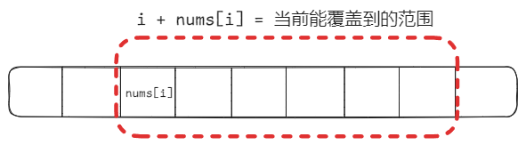

## 买卖股票的最佳时机 II

[122. 买卖股票的最佳时机 II](https://leetcode.cn/problems/best-time-to-buy-and-sell-stock-ii/)

这里的想法其实容易陷入一个误区，就是我们一般都会认为在最低点买入，在最高点卖出，这样就能获得最大的收益。

而其实我们可以在每一个上升的区间内进行交易，来获得最大的收益。

当我们把利润分解为以每天为单位的利润时，我们就可以把每一天的利润都加起来，来获得最大的收益。

局部最优解：
- 收集每天的正利润
全局最优解：
- 收集所有的正利润

假设我们在第 `i` 天买入，第 `j` 天卖出，那么我们可以将利润分解为：

```ini
利润 = 第 j 天的价格 - 第 i 天的价格
     = (第 j 天的价格 - 第 (j-1) 天的价格) + (第 (j-1) 天的价格 - 第 (j-2) 天的价格) + ... + (第 i+1 天的价格 - 第 i 天的价格)
```

所以其实我们只要判断当前的价格是否比前一天的价格高，如果是，就将差值加入到利润中。

```cpp
class Solution {
public:
    int maxProfit(vector<int>& prices) {
        if (prices.size() < 2) return 0;
        int sum = 0;
        for (int i = 1; i < prices.size(); i++) {
            // 如果今天的价格比昨天高，则计算利润
            if (prices[i] > prices[i - 1]) {
                sum += prices[i] - prices[i - 1];
            }
        }
        return sum;
    }
};
```

## 跳跃游戏

[55. 跳跃游戏](https://leetcode.cn/problems/jump-game/)

这里重要的不是每次跳多少步，而是跳跃的范围能否覆盖最后一个元素。

我们可以定义一个变量 `maxReach`，表示当前能跳到的最远位置。
`i + nums[i]` 表示当前下标 `i` 能跳到的最远位置。
如果当前的下标 `i` 大于 `maxReach`，说明无法到达最后一个元素，返回 `false`。

如图所示：



那么我们只要在遍历数组的过程中，如果遍历到尾了，那么返回 `true`就可以了。

```cpp
class Solution {
public:
    bool canJump(vector<int>& nums) {
        if (nums.size() == 1) return true; // 只有一个元素，返回true
        int maxReach = 0;
        for (int i = 0; i < nums.size(); i++) {
            if (maxReach < i) { // 如果跳跃的范围到不了当前的下标
                return false; // 直接返回false
            }
            else { // 否则更新当前跳跃的最大范围
                maxReach = max(maxReach, i + nums[i]);
            }
        }
        return true;
    }
};
```

这道题目关键点在于不用拘泥于每次究竟跳几步，而是看覆盖范围，覆盖范围内一定是可以跳过来的，不用管是怎么跳的。

## 跳跃游戏 II

[45. 跳跃游戏 II](https://leetcode.cn/problems/jump-game-ii/)

题的核心是用贪心思想模拟 BFS 的层次遍历，每次“跳跃”都尽可能跳得远。

我们定义以下几个变量：

- `curEnd`：当前这一跳所能到达的最远位置（当前“层”的边界）

- `curFarthest`：下一跳所能到达的最远位置

- `jumps`：跳跃次数

把每次跳跃看作 BFS 中的一“层”：

- `curEnd` 是当前层的最远边界，

- `curFarthest` 是我们能探索到的下一层最远边界，

- 一旦我们走到了 `curEnd`，说明该跳一次了（从当前层跳到下一层），此时就增加一次跳跃次数。

```cpp
class Solution {
public:
    int jump(vector<int>& nums) {
        if (nums.size() == 1) return 0;
        int jumps = 0;
        int curEnd = 0;
        int curFarthest = 0;
        int n = nums.size();
        for (int i = 0; i < n - 1; ++i) {
            curFarthest = max(curFarthest, i + nums[i]);  // 能跳的最远
            if (i == curEnd) {  // 到了当前这跳的最远位置
                jumps++;            // 需要跳一次
                curEnd = curFarthest;  // 更新下一跳的边界
            }
        }
        return jumps;
    }
};
```

我们可以把这个过程想象成一个 BFS 的过程：

假定：
```ini
nums = [2, 3, 1, 1, 4]
index:  0   1   2   3   4
```

转换成树结构，格式是：节点(值) → 子节点
```
         0(2)
        /   \
     1(3)   2(1)
    / | \     \
 3(1) 4(4)     3(1)
```
最短路径是：0 → 1 → 4，即跳跃次数为2。

## K次取反后最大化的数组和  

[1005. K 次取反后最大化的数组和](https://leetcode.cn/problems/maximize-sum-of-array-after-k-negations/)

我们的目标是尽可能多地把负数变成正数，因为正数才对总和有贡献。

步骤如下：
1. 把数组按绝对值从大到小排序；

2. 从前往后遍历，如果当前是负数且还有操作次数，就取反；

3. 如果最后还剩奇数个 `k`，对最后一个元素（绝对值最小的）再取反一次；如果是偶数个 `k`，则不需要再取反，因为两个负号抵消了。

代码如下：

```cpp
class Solution {
public:
    int largestSumAfterKNegations(vector<int>& nums, int k) {
        // 按照绝对值从大到小排序
        sort(nums.begin(), nums.end(), [](int a, int b) { //使用lamda表达式进行排序
            return abs(a) > abs(b);
        });
        for (int i = 0; i < nums.size(); ++i) {
            if (nums[i] < 0 && k > 0) {
                nums[i] = -nums[i];  // 取反负数
                --k;
            }
        }
        // 如果 k 还剩奇数次，对最小的那个数取反（一定是最后一个）
        if (k % 2 == 1) {
            nums[nums.size() - 1] = -nums[nums.size() - 1];
        }
        return accumulate(nums.begin(), nums.end(), 0);
    }
};
```