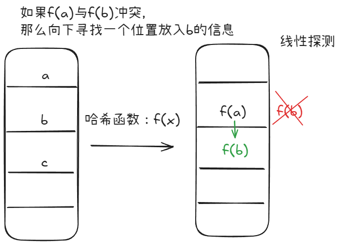
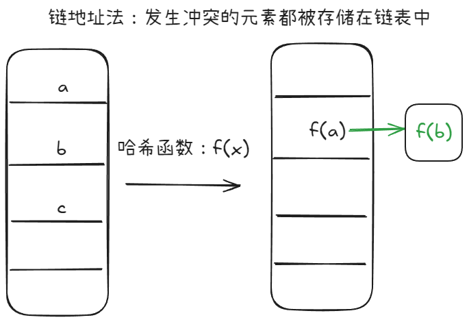

## 1. **哈希表**

### 哈希表的概念

哈希表（Hash Table），也叫做散列表，是一种键值对（key-value）存储的数据结构，能够在平均O(1)的时间复杂度下进行查找，插入和删除的操作，广泛运用于数据库，缓存系统，计数统计等场景。

哈希表的核心思想是利用 哈希函数（Hash Function） 将键（Key）映射到数组的某个位置（索引），从而 快速存取数据。

### 哈希表的基本组成

- 键（Key）：用于唯一标识数据的值，如 "apple"、123、user_id。
- 值（Value）：键对应的存储数据，如 "fruit"、"张三"、56.7。
- 哈希函数（Hash Function）：将键转换为数组索引的函数。
- 哈希桶（Bucket）：用于存储键值对的数据单元。
- 冲突解决机制：当不同的键被映射到相同的位置时，如何处理（如链地址法、开放寻址法等）。

### 哈希函数

哈希函数[^1]用于将任意的键值映射到一个固定的索引值，一个好的哈希函数应该具有：

- 均匀性（Uniformity）：不同的键应该尽可能均匀地分布到哈希表中。
- 确定性（Deterministic）：相同的输入必须产生相同的输出。
- 高效性（Efficiency）：计算哈希值的时间开销要尽可能小。


[^1]: [Hash function - Wikipedia](https://en.wikipedia.org/wiki/Hash_function)

### 哈希碰撞

哈希碰撞（Hash Collision）是指两个不同的键映射到相同的索引，常见的解决哈希碰撞的方法有：

1. 开放寻址法：当发生冲突时，寻找下一个空闲位置存储数据，如果还是冲突，继续寻找下一个空闲位置。
当然，开放寻址法也有多种实现方式，如**线性探测**、**二次探测**、**双重散列**等，图中是线性探测的示例。

:::tip
开放寻址法的优点是不需要额外的链表存储，缺点是当负载因子较大时，查找性能会下降。
:::




2. 链地址法：也叫拉链法，每个哈希桶存储一个链表（或其他数据结构），当多个键映射到相同索引时，放入链表中。

:::tip
链地址法的有点是实现简单，易于扩展，缺点是当链表过长时，查找性能会下降（退化为 `O(n)`）。
:::



### 常见的哈希结构[^2]

在哈希表中，常用的数据结构有：

- 数组
- set（集合）
- map（映射）

​在 C++ 标准模板库（STL）中，`set` 和 `map` 是两种常用的关联容器，用于存储具有特定规则的数据。​它们的底层实现通常采用 红黑树，这是一种自平衡的二叉搜索树，确保了元素的有序性和操作的高效性。

在C++中，`set` 和 `map` 分别提供以下三种数据结构，其底层实现以及优劣如下表所示：

集合|	底层实现|	是否有序|	数值是否可以重复|	能否更改数值|	查询效率|	增删效率|
|----|----------------------|---------------|---------|-----------------|---------|---------|
`std::set`|	红黑树|	有序|	否|	否|	O(log n)|	O(log n)|
`std::multiset`|	红黑树|	有序|	是|	否|	O(logn)|	O(logn)|
`std::unordered_set`|	哈希表|	无序|	否|	否|	O(1)|	O(1)|

`std::unordered_set` 底层实现为哈希表，`std::set` 和 `std::multiset` 的底层实现是红黑树，红黑树是一种平衡二叉搜索树，所以 `key` 值是有序的，但 `key` 不可以修改，改动 `key` 值会导致整棵树的错乱，所以只能删除和增加。

映射|	底层实现|	是否有序|	数值是否可以重复|	能否更改数值|	查询效率|	增删效率|
|----|----------------------|---------------|---------|-----------------|---------|---------|
`std::map`|	红黑树|	key有序|	key不可重复|	key不可修改|	O(logn)|	O(logn)|
`std::multimap`|	红黑树|	key有序|	key可重复|	key不可修改|	O(log n)|	O(log n)|
`std::unordered_map`|	哈希表|	key无序|	key不可重复|	key不可修改|	O(1)|	O(1)|

`std::unordered_map` 底层实现为哈希表，`std::map` 和 `std::multimap` 的底层实现是红黑树。同理，std::map 和 `std::multimap` 的 `key` 也是有序的。

当我们要使用集合来解决哈希问题的时候，优先使用 `unordered_set`，因为它的查询和增删效率是最优的，如果需要集合是有序的，那么就用 `set`，如果要求不仅有序还要有重复数据的话，那么就用 `multiset`。

那么再来看一下 `map` ，在 `map` 是一个 `key` `value` 的数据结构，`map` 中，对 `key` 是有限制，对 `value` 没有限制的，因为 `key` 的存储方式使用红黑树实现的。

其他语言例如：java里的 `HashMap` ，`TreeMap` 都是一样的原理。可以灵活贯通。

虽然 `std::set` 和 `std::multiset` 的底层实现基于红黑树而非哈希表，它们通过红黑树来索引和存储数据。不过给我们的使用方式，还是哈希法的使用方式，即依靠键 `key` 来访问值 `value`。所以使用这些数据结构来解决映射问题的方法，我们依然称之为哈希法。`std::map` 也是一样的道理。

[^2]: [代码随想录-常见的三种哈希结构](https://programmercarl.com/%E5%93%88%E5%B8%8C%E8%A1%A8%E7%90%86%E8%AE%BA%E5%9F%BA%E7%A1%80.html#%E5%B8%B8%E8%A7%81%E7%9A%84%E4%B8%89%E7%A7%8D%E5%93%88%E5%B8%8C%E7%BB%93%E6%9E%84)

## 2. **有效的字母异位词**

[242.有效的字母异位词](https://leetcode-cn.com/problems/valid-anagram/)

### 数组实现
这里要注意的是，题中给出的是小写字母，所以这个数据是比较小的，我们可以使用数组来实现哈希表。

```cpp
bool isAnagram(string s, string t) {
    // 用数组来实现哈希表
    int hash[26] = {0};
    // 遍历s
    for (char c : s) { 
        hash[c - 'a']++; 
    }
    // 遍历t
    for (char c : t) {
        hash[c - 'a']--;
    }
    // 检查数组是否全部为0
    for (int i = 0; i < 26; i++) {
        if (hash[i] != 0) return false;
    }
    return true;
}
```
这里其实掌握了 `hash[c - 'a']` 这个概念，就很好理解了，`c - 'a'` 代表的就是当前字符在数组中的位置，然后做递增操作就能得到这个字符出现的次数。

然后通过相同的操作再对另一个字符串做递减操作，最后检查数组是否全部为0，如果不为0，说明两个字符串不是字母异位词。

顺便附上随想录中的图解[^3]，这样更好理解。


[^3]: [代码随想录-242.有效的字毨异位词](https://programmercarl.com/0242.%E6%9C%89%E6%95%88%E7%9A%84%E5%AD%97%E6%AF%8D%E5%BC%82%E4%BD%8D%E8%AF%8D.html#%E6%95%B0%E7%BB%84%E5%AE%9E%E7%8E%B0)
### map实现

```cpp
bool isAnagram(string s, string t) {
    // 用map实现
    unordered_map<char, int> count;

    for (char c : s) count[c]++;
    for (char c : t) {
        count[c]--;
        if (count[c] < 0) return false;
    }

    // 检查map元素
    for (const auto& pair : count) { // 自动推导pair类型
        if (pair.second != 0) return false; // second指的是定义的count类型的第二个元素
    }
    return true;
}
```

整体思路其实是一致的，只是这个题目的数据量小，适合用数组。

最后这里并不适用 `set`，因为 `set` 是用来存储不重复的元素的，而这里是要统计每个元素的个数。

## 两个数组的交集

[349.两个数组的交集](https://leetcode-cn.com/problems/intersection-of-two-arrays/)

:::tip[什么时候用set什么时候用数组？]
当一个问题中的数据量比较小，且数据量有限时，我们可以使用数组来实现哈希表。而当数据量比较大时，或者是数据量很分散的时候我们可以使用 `set` 来实现哈希表。例如 `[1, 2, 10000]`,这个数据很分散，如果用数组来实现哈希表，会浪费很多空间(需要开辟一个长度10000的数组)。
:::

```cpp
vector<int> intersection(vector<int>& nums1, vector<int>& nums2) {
    // 用set实现哈希表
    unordered_set<int> set(nums1.begin(), nums1.end()); // 将nums1中的元素放入set中
    unordered_set<int> ans;

    for (int i : nums2) {
        if (set.find(i) != set.end()) { // 判断nums2中的元素在set中是否存在，否则返回set.end()
            ans.insert(i); // 将该元素插入到ans中
        }
    }
    return vector<int>(ans.begin(), ans.end()); // 将ans转换为vector返回
}
```

## 快乐数

[202.快乐数](https://leetcode-cn.com/problems/happy-number/)

### 哈希表解法
这里可以这么思考，如果一个数不是快乐数，那么它不是快乐数的理由是什么？

- 在验证快乐数的过程中，某次计算的结果出现了重复，从而导致无限循环。

因此，我们只要记录每次计算的结果，如果这个结果重复了，那么之后的计算必然是陷入无限循环。所以我们的思路就是使用一个哈希表来记录每次计算的结果，如果结果重复，那么就返回 `false`。

那么我们就可以使用 `unordered_set` 来实现哈希表。

```cpp
int getsum (int n) {
    int sum = 0;
    while (n) {
        sum += (n % 10) * (n % 10); // 计算每一位的平方和
        n = n / 10;
    }
    return sum;
}
bool isHappy(int n) {
    unordered_set<int> all_sum;
    int cur_sum = 0;
    while (true) {
        cur_sum = getsum(n); // 计算平方和
        if (cur_sum == 1) return true; // 如果平方和为1，返回true
        if (all_sum.find(cur_sum) != all_sum.end()) return false; // 如果平方和重复，返回false
        else all_sum.insert(cur_sum);
        n = cur_sum;
    }
}
```

- 时间复杂度: `O(logn)`

    - `getsum(n)` 计算平方和的时间复杂度是 `O(log n)`（数字有 log n 位，每位计算 x^2）。
    - 最坏情况 下，`n` 可能进入一个循环，导致 `seen.insert(n)` 运行 `O(log n)` 次。
    - 综合复杂度：`O(logn)`

- 空间复杂度: `O(logn)`

### 快慢指针解法

之前在链表中的[环形链表](https://m1dnightsun.github.io/MidnightSun-Blog/posts/programmercarl/linkedlist/day04_linkedlist_part2/#2-%E5%A6%82%E4%BD%95%E7%A1%AE%E5%AE%9A%E7%8E%AF%E7%9A%84%E5%85%A5%E5%8F%A3floyd-%E5%88%A4%E5%9C%88%E6%B3%95)中介绍过Flyod判圈算法，这里也可以使用快慢指针来解决这个问题。

快慢指针的方法如下：
- 快指针 `fast` 每次走两步，即 `fast = getsum(getsum(fast))`，每次运算两次 `getsum()`
- 慢指针 `slow` 每次走一步，即 `slow = getsum(slow)`

之后会出现两种情况：
- 如果 `fast` 和 `slow` 相遇，说明存在循环，返回 `false`
- 如果 `fast` 等于1，说明是快乐数，返回 `true`

我们假设 `n = 19`，那么计算过程如下：

```ini
n = 19 → 82 → 68 → 100 → 1  ✅（快乐数）

```
如果 `n = 2`，那么计算过程如下：

```ini
n = 2 → 4 → 16 → 37 → 58 → 89 → 145 → 42 → 20 → 4 ❌（不是快乐数）
        ↑                                       ↑
        └───────────────────────────────────────┘
        存在循环，那么就会演变成fast追slow，最终相遇 

```

双指针方法的代码如下：
```cpp
int getsum (int n) {
    int sum = 0;
    while (n) {
        sum += (n % 10) * (n % 10); // 计算每一位的平方和
        n = n / 10;
    }
    return sum;
}
bool isHappy(int n) {
    int slow = n, fast = getsum(n);
    while (fast != 1 && slow != fast) { // 当fast等于1或者slow等于fast时，退出循环
        slow = getsum(slow);
        fast = getsum(getsum(fast));
    }
    return fast == 1;
}
```

## 两数之和
    
[1.两数之和](https://leetcode-cn.com/problems/two-sum/)

当我们需要查询一个元素是否出现过，或者一个元素是否在集合里的时候，就要第一时间想到哈希法。

在这个题目中，我们可以使用哈希表来存储每个元素的索引，然后在遍历的过程中，查询 `target - nums[i]` 是否在哈希表中，如果在，那么就返回这两个元素的索引。

在这个情形中，我们不仅要保存元素的值，还需要保存元素的索引，所以我们可以使用 `map`。
而我们不需要元素有序，所以我们可以使用 `unordered_map` 来实现哈希表。

:::tip[map中 key 和 value 分别表示什么]
判断元素是否出现，这个元素就要作为 `key`，所以数组中的元素作为 `key`，有 `key` 对应的就是 `value`，`value` 用来存下标。
所以 map中的存储结构为 {`key`：`数据元素`，`value`：`数组元素对应的下标`}。
:::

```cpp
vector<int> twoSum(vector<int>& nums, int target) {
    // key：target-nums[i]，value: 下标i
    unordered_map<int, int> map;
    vector<int> ans;
    for (int i = 0; i < nums.size(); i++) {
        if (map.find(target - nums[i]) != map.end()) { // 如果找到了
            int a = map[target - nums[i]]; // 也可以是map.find(target - nums[i])->second
            int b = i;
            ans.push_back(a);
            ans.push_back(b);
            return ans;
        }
        map.insert(pair<int, int>(nums[i], i));
    }
    return {};
}
```
本题其实有四个重点：

- 为什么会想到用哈希表：因为要查询元素是否出现过
- 哈希表为什么用map：因为不仅要存储元素，也要存储元素的下标
- 本题map是用来存什么的：存储的是 `target - nums[i]` 和 `i` 的对应关系，类比python中的{`target - nums[i]`：`i`}
- map中的key和value用来存什么的：key存储的是 `target - nums[i]`，value存储的是 `i`

把这四点想清楚了，才算是理解透彻了。

## 总结

我们需要养成一个习惯，当遇到需要查询元素是否出现过，或者一个元素是否在集合里的时候，就要第一时间想到哈希法。

然后清楚什么时候用数组，什么时候用集合，什么时候用映射。
- 当数据量比较小，且数据量有限时，我们可以使用数组来实现哈希表。
- 当数据量比较大时，或者是数据量很分散的时候我们可以使用 `set` 来实现哈希表。
- 当我们需要存储键值对的时候，我们可以使用 `map` 来实现哈希表。