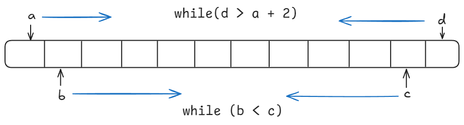

## 1. **四数相加**

[454.四数相加II](https://leetcode-cn.com/problems/4sum-ii/)

这题的思考方式其实和之前写过的[有效的字母异位词](https://m1dnightsun.github.io/MidnightSun-Blog/posts/programmercarl/hash-table/day06_hashtable_part1/#2-%E6%9C%89%E6%95%88%E7%9A%84%E5%AD%97%E6%AF%8D%E5%BC%82%E4%BD%8D%E8%AF%8D)

四数相加和四数之和是有区别的，四数之和是在同一个数组中要求四个数的和等于目标值。

其实一开是也想到了将数组两两分组，然后用哈希表来解决，但是想了想好像这个时间复杂度都已经O(n^2)了，总不至此吧。

事实上，这个解法是正确的，后续也查阅过貌似无法再优化时间复杂度到O(n^2)以下。

整体思路与之前的题目类似：

```cpp
int fourSumCount(vector<int>& nums1, vector<int>& nums2, vector<int>& nums3, vector<int>& nums4) {
    // 哈希表，两两数组分别处理
    unordered_map<int, int> map;
    int count = 0;
    // 将a+b映射到map中
    for (int a : nums1) {
        for (int b : nums2) {
            map[a+b]++;
        }
    }
    // 在map中查找0 - (c + d)
    for (int c : nums3) {
        for (int d : nums4) {
            int target = - (c + d);
            if (map.find(target) != map.end()) {
                count += map[target]; // 这里注意count是要加上所有符合条件的元组
            }
        }
    }
    return count;
}
```

这里需要注意的是，要求的是所有符合条件的元组，所以在进行哈希表查询的时候，`count` 要加上所有符合条件的元组，也就是 `map[target]` 的值。

## 2. **赎金信**

[383.赎金信](https://leetcode-cn.com/problems/ransom-note/)

这道题的思路其实和前面的差不多，都是通过建立哈希表，然后从另一个字符串中查找是否存在。

用map的实现（无论是将magazine还是ransomNote做成哈希表都可以实现）：
```cpp
// 将magazine做成哈希表
bool canConstruct(string ransomNote, string magazine) {
    unordered_map<char, int> map;
    for (char c : magazine) {
        map[c]++;
    }
    for (char c : ransomNote) {
        if (map.find(c) != map.end()) { // 如果在哈希表中找到了ransomNote中的字符
            if (map[c] <= 0) return false; // 如果哈希表中的值小于等于0，说明ransomNote中不存在这个字符
            else map[c]--; // 否则哈希表中的值减1，也就是找到了
        }
        else return false; // 如果在哈希表中没有找到ransomNote中的字符，直接返回false
    }
    return true;
}

// 如果将ransomNote做成哈希表
bool canConstruct(string ransomNote, string magazine) {
    unordered_map<char, int> map;
    for (char c :  ransomNote) { // 将ransomNote做成哈希表
        map[c]++;
    }
    for (char c : magazine) { // 在magazine中查找
        if (map.find(c) != map.end()) { // 如果在哈希表中找到了magazine中的字符
            if (map[c] <= 0) continue; // 如果哈希表中的值小于等于0，则说明magazine中已经满足了ransomNote中的字符，直接跳过
            else map[c]--; // 否则哈希表中的值减1
        }
    }
    //检查map中键的值是否都为0
    for (auto& pair : map) {
        if (pair.second != 0)return false;
    }
    return true;
}
```

在本题的情况下，使用map的空间消耗要比数组大一些的，因为map要维护红黑树或者哈希表，而且还要做哈希函数，是费时的，数据量大的话就能体现出来差别了：

```cpp
// 用数组来实现
bool canConstruct(string ransomNote, string magazine) {
    int count[26] = {0};

    for (char c : magazine) {
        count[c - 'a']++;
    }

    for (char c : ransomNote) {
        count[c - 'a']--;
        if (count[c - 'a'] < 0) return false;
    }
    return true;
}
```

## 3. **三数之和**

[15.三数之和](https://leetcode-cn.com/problems/3sum/)

其实这道题用哈希表来解决是不太合适的，因为涉及到复杂的去重操作，而且时间复杂度也不会比排序+双指针更优。

这里我们可以使用双指针的解法：

我们首先将数组进行排序，同时定义 `left` 和 `right` 指针，然后遍历数组，对于每一个元素，我们都将其作为第一个元素，然后在剩下的元素中使用双指针来寻找另外两个元素。

依然还是在数组中找到 `abc` 使得 `a + b +c = 0`，我们这里相当于 `a = nums[i]`，`b = nums[left]`，`c = nums[right]`。

接下来如何移动 `left` 和 `right`， 如果 `nums[i] + nums[left] + nums[right] > 0` 就说明 此时三数之和大了，因为数组是排序后了，所以 `right` 下标就应该向左移动，这样才能让三数之和小一些。

如果 `nums[i] + nums[left] + nums[right] < 0` 说明 此时 三数之和小了，`left` 就向右移动，才能让三数之和大一些，直到 `left` 与 `right` 相遇为止。

总体代码如下：
    
```cpp
vector<vector<int>> threeSum(vector<int>& nums) {
    sort(nums.begin(), nums.end()); // 对数组排序
    vector<vector<int>> ans;
    if (nums[0] > 0 || nums[nums.size() - 1] < 0) return {};
    for (int i = 0; i < nums.size() - 1; i++) {
        if (i >0 && nums[i] == nums[i - 1]) continue; // 对i进行去重操作，注意i是与上一次比较
        int left = i + 1;
        int right = nums.size() - 1;

        while (left < right) {
            if (nums[i] + nums[left] + nums[right] > 0) right--;
            else if (nums[i] + nums[left] + nums[right] < 0) left ++;
            else {
                ans.push_back({nums[i], nums[left], nums[right]}); // 保存结果集
                while (left < right && nums[left] == nums[left + 1]) left++; // 对left去重
                while (left < right && nums[right] == nums[right - 1]) right--; // 对right去重
                // 去重结束后，再移动一位
                left++; 
                right--;
            }
        }
    }
    return ans;
}
```
时间复杂度：O(n^2)
- `i` 遍历一次数组，时间复杂度为O(n)。
- `left` 和 `right` 使用双指针，时间复杂度为O(n)。

对于去重的思考：

- 对于 `a` 的去重，要判断 `nums[i] == nums[i - 1]`，因为 `i` 是与上一次比较的。
- 对于 `b` 的去重，要判断 `nums[left] == nums[left + 1]`，因为 `left` 是与上一次比较的。
- 对于 `c` 的去重，要判断 `nums[right] == nums[right - 1]`，因为 `right` 是与上一次比较的。
- 最后因为去重是持续进行的，所以要使用 `while` 循环，直到不重复为止。

## 4. **四数之和**

[18.四数之和](https://leetcode-cn.com/problems/4sum/)

做了三数之和之后，其实四数之后就很好理解了，无疑是在外面再套一层循环。

主要的问题还是在剪枝和去重的操作上。

这里剪枝操作不同于[三数之和](#三数之和)的地方在于，数据中可能存在负数，所以之前的条件不能照搬。
如果要进行剪枝，我们要使用:
```cpp
 if (nums[a] > target && nums[a] > 0) break;
```

有了三数之和的基础上，很容易写出以下代码，不过这里的与随想录的代码不同的是，我使用的是从两侧靠拢的思路：


```cpp
vector<vector<int>> fourSum(vector<int>& nums, int target) {
    sort(nums.begin(), nums.end());
    vector<vector<int>> ans = {};
    // 这里不能像三数之和那样做剪枝操作，因为可能存在负数
    // if (nums[0] > target || nums[nums.size() - 1] < target) return {};
    for (int a = 0; a < nums.size(); a++) {
        if (a > 0 && nums[a] == nums[a - 1]) continue; // 对a进行去重
        for (int d = nums.size() - 1; d > a + 2; d--) {
            if (d < nums.size() - 1 && nums[d] == nums[d + 1]) continue; // 对d进行去重
            int b = a + 1;
            int c = d - 1;
            while (b < c) {
                // sum = nums[a] + nums[b] + nums[c] + nums[d];
                // 这里应该使sum的类型为long long，int类型可能会溢出
                long long sum = (long long)nums[a] + nums[b] + nums[c] + nums[d];
                if (sum > target) c--;
                else if (sum < target) b++;
                else {
                    ans.push_back({nums[a], nums[b], nums[c], nums[d]});
                    while (b < c && nums[b] == nums[b + 1]) b++; // 对b进行去重
                    while (b < c && nums[c] == nums[c - 1]) c--; // 对c进行去重
                    // 去重结束后，再移动一位
                    b++;
                    c--;
                }   
            }
        }
    }
    return ans;
}
```
这里要注意的是题中给出的条件是 `-10^9 <= nums[i] <= 10^9`，`-109 <= target <= 109`，在计算的时候如果sum的类型是 `int`，那么可能会导致结果溢出，保险起见将 `sum` 设置为 `long long` 类型（在提交代码的时候不通过也是因为这个原因）。

时间复杂度为O(n^3)
- `a` 遍历一次数组，时间复杂度为O(n)。
- `d` 遍历一次数组，时间复杂度为O(n)。
- `b` 和 `c` 使用双指针，时间复杂度为O(n)。


## 总结

这里的两道题其实都没有使用哈希表，而是使用了排序+双指针的方法。

时间复杂度高的算法，就不需要再感到意外了，不能因为是个O(n^2)的算法就默认不是最优解。

会了三数之和，四数之和感觉通透了，没看视频也能自己写出来了~~除了sum的类型溢出问题整了好久。~~
