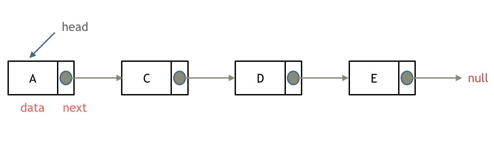

## 链表基础

### 1. **定义**
链表（Linked List）是一种**线性数据结构**，由一系列的节点（Node）组成，每个节点包含**数据**和**指向下一个节点的指针**。相较于数组，链表的特点是**动态存储、插入和删除操作更高效**，但**随机访问速度较慢**。

### 2. **链表的种类**
链表可以分为以下几种类型[^1]：

1. **单链表（Singly Linked List）**：每个节点存储一个指向下一个节点的指针。

2. **双向链表（Doubly Linked List）**：每个节点存储**前后两个指针**（指向前驱和后继）。

3. **循环链表（Circular Linked List）**：链表的**最后一个节点**指向**头节点**，形成循环。

4. **双向循环链表（Doubly Circular Linked List）**：结合双向链表和循环链表的特性。

[^1]: [代码随想录-关于链表，你该了解这些！](https://programmercarl.com/%E9%93%BE%E8%A1%A8%E7%90%86%E8%AE%BA%E5%9F%BA%E7%A1%80.html#%E5%85%B3%E4%BA%8E%E9%93%BE%E8%A1%A8-%E4%BD%A0%E8%AF%A5%E4%BA%86%E8%A7%A3%E8%BF%99%E4%BA%9B)

### 3. **链表的基本操作**
链表的核心操作包括：
- **插入（Insertion）**
- **删除（Deletion）**
- **查找（Search）**
- **遍历（Traversal）**

关于这部分的内容，会在后面的内容进行更详细的讲解。


### 4. **链表与数组的对比**

|    |插入/删除（时间复杂度）|查询（时间复杂度）|适用的场景|
|----|----------------------|---------------|---------|
|数组|`O(n)`|`O(1)`|数据量固定，频繁查询，较少的增删操作|
|链表|`O(1)`|`O(n)`|数据量不固定，频繁的增删操作，较少的查询|

## 移除链表元素

[203.移除链表元素](https://leetcode-cn.com/problems/remove-linked-list-elements/description/) 

对于删除链表中的节点，一般的步骤是这样的：


:::important[删除过程中要注意的问题]
需要相当注意的是，在删除一个节点时，操作的对象一定是**前一个节点**，而不是当前节点。因为在删除才做中，一定需要使被删除节点的前一个节点的`next`指针指向被删除节点的下一个节点。
:::

```cpp
ListNode* temp = cur->next;
cur->next = cur->next->next;
delete temp; // 在C++中，需要手动释放内存
```
在移除链表元素时，可以有几种方法：

### 1. **直接在原链表上操作**

这里需要注意的是，如果头节点是要删除的节点，那么需要特殊处理。

```cpp
ListNode* removeElements(ListNode* head, int val) {
    while (head != nullptr && head->val == val) { // 这里要使用while而不是if，因为可能有多个连续的节点都是要删除的节点
        ListNode* temp = head;
        head = head->next;
        delete temp;
    }

    // 定义前驱节点
    ListNode* cur = head;
    while (cur != nullptr && cur->next != nullptr) { 
        if (cur->next->val == val) {
            ListNode* temp = cur->next;
            cur->next = cur->next->next;
            delete temp;
        }
        else {
            cur = cur->next;
        }
    }
    return head;
}
```
### 2. **使用虚拟头节点**
使用虚拟头节点可以简化代码逻辑，避免对头节点的特殊处理。

```cpp
ListNode* removeElements(ListNode* head, int val) {
        ListNode* dummyhead = new ListNode(0, head); // 创建虚拟头节点
        ListNode* cur = dummyhead; // 定义前驱节点
        while (cur->next) { 
            if (cur->next->val == val) {
                ListNode* temp = cur->next;
                cur->next = cur->next->next;
                delete temp;
            }
            else cur = cur->next;
        }
        head = dummyhead->next;
        delete dummyhead;
        return head;
    }
```

### 3. **递归**
递归删除链表元素是利用递归函数的调用栈，逐层返回时执行删除操作，从而达到删除链表节点的目的。

```cpp
ListNode* removeElements(ListNode* head, int val) {
    if (head == nullptr) { // 递归终止条件
        return head;
    }
    head->next = removeElements(head->next, val); // 递归调用
    return head->val == val ? head->next : head; // 如果当前节点的值等于 val，则删除当前节点
}
```

## 设计链表

[707.设计链表](https://leetcode-cn.com/problems/design-linked-list/description/)

这里我们需要设计一个链表的数据结构，支持以下操作：
1. 获取链表的第`index`个节点的值。
2. 在链表的头部插入一个新节点。
3. 在链表尾部插入一个新节点。
4. 在链表中的第`index`个节点前添加一个新节点。
5. 删除链表中的第`index`个节点。

```cpp
class MyLinkedList {
public:

    struct ListNode { // 定义链表节点
        int val;
        ListNode* next;
        ListNode(int val): val(val), next(nullptr){} // 构造函数
    };
    
    MyLinkedList() {
        _size = 0; // 初始化链表长度
        _dummyhead = new ListNode(0); // 创建虚拟头节点
    }
    
    int get(int index) { // 获取第index个节点的值
        // 注意下标问题，这里的index是从0开始的，例如只有一个元素，那么它的index(0)=size-1
        if (index < 0 || index > (_size - 1)) return -1; // index是从0开始的，所以判断条件是size-1
        ListNode* cur = _dummyhead->next; 
        while (index--){
            cur = cur->next;
        }
        return cur->val;
    }
    
    void addAtHead(int val) { // 在头部添加节点
        ListNode* new_node = new ListNode(val); // 创建新节点
        new_node->next = _dummyhead->next; // 新节点直接指向虚拟头节点的下一个节点
        _dummyhead->next = new_node; // 虚拟头节点指向新节点，新节点成为新的头节点
        _size++; // 链表长度+1
    }
    
    void addAtTail(int val) { // 在尾部添加节点
        ListNode* new_node = new ListNode(val); // 创建新节点
        ListNode* cur = _dummyhead; // 创建前驱节点，指向虚拟头节点
        while (cur->next != nullptr) { // 遍历到链表尾
            cur = cur->next;
        }
        cur->next = new_node; // 前驱节点指向新节点
        _size++; // 链表长度-1
    }
    
    void addAtIndex(int index, int val) { // 在第index个节点前添加节点
        if (index > _size || index < 0) {return;} // 若index不合法，如果index=size，则说明在末尾添加
        //如果index=0，则说明在头部添加
        ListNode* new_node = new ListNode(val); // 创建新节点
        ListNode* cur = _dummyhead; // 创建前驱节点，指向虚拟头节点
        while (index--) { // 遍历到index位置，例如index=0，即在头节点插入
            cur = cur->next;
        }
        new_node->next = cur->next; // 新节点指向前驱节点的下一节点
        cur->next = new_node; // 前驱节点指向新节点
        _size++; // 链表长度+1
    }
    
    void deleteAtIndex(int index) { // 删除第index个节点
        if (index >= _size || index < 0) {return;} //若index不合法
        //eg. 若size=1，index=1，那要删除的其实是第二个节点（不存在），所以不合法
        ListNode* cur = _dummyhead; // 创建前驱节点指向虚拟头节点
        while (index--) { // 遍历到index节点
            cur = cur->next;
        }   
        ListNode* temp = cur->next; // 将要删除的节点保存到临时节点
        cur->next = cur->next->next; // 前驱节点指向要删除节点的下一个节点
        delete temp; // 删除临时节点
        //delete命令指示释放了tmp指针原本所指的那部分内存，
        //被delete后的指针tmp的值（地址）并非就是NULL，而是随机值。也就是被delete后，
        //如果不再加上一句tmp=nullptr,tmp会成为乱指的野指针
        //如果之后的程序不小心使用了tmp，会指向难以预想的内存空间
        temp=nullptr;
        _size--;       
    }

private:
    int _size; // 链表长度
    ListNode* _dummyhead; // 虚拟头节点
};
```
:::important[添加节点的顺序问题]
和删除链表中元素类似，在链表中添加节点的时候，一定要注意操作的顺序：
1. 新节点指向前驱节点的下一个节点
2. 前驱节点指向新节点
:::

## 反转链表

[206.反转链表](https://leetcode-cn.com/problems/reverse-linked-list/description/)

反转链表是一个对考察基础数据结构操作能力很好的问题。

### 1. **双指针解法**
在这里可以定义一个前驱节点`pre`和一个当前节点`cur`：


然后让`cur`指向`pre`


当`cur`为空时，说明已经遍历完链表，此时`pre`指向的就是反转后的链表头节点。


用双指针的写法如下：
```cpp
ListNode* reverseList(ListNode* head) {
        if (head == nullptr) return head; 
        ListNode* cur = head; // 定义cur指向头节点
        ListNode* pre = nullptr; //定义pre指向空节点
        ListNode* temp; // 定义临时节点用于存储cur的下一个节点
        while (cur) { // 当cur指向空时，说明遍历结束
            temp = cur->next; // 存储cur的下一个节点
            cur->next = pre; // 翻转操作
            pre = cur; // 将pre向前移
            cur = temp; //将cur向后移
        }
        return pre;
    }
```
在这里需要注意的就是操作的顺序，一定是先存储`cur`的下一个节点，然后再进行翻转操作，先将`pre`向前移，再将`cur`向后移。

### 2. **递归解法**

可以依据双指针的思路，写出递归的解法。和双指针法是一样的逻辑，同样是当cur为空的时候循环结束，不断将cur指向pre的过程。
```cpp
// 递归写法
ListNode* reverse(ListNode* pre, ListNode* cur) {
    if (cur == nullptr) return pre; // 递归终止条件，终止之后，返回的是pre
    // 单层递归
    ListNode* temp = cur->next;
    cur->next = pre; // 翻转操作
    // 进入下一层递归
    // pre = cur;
    // cur = temp; 
    return reverse(cur, temp); // 按照双指针的解法来写
}

ListNode* reverseList(ListNode* head) {
    return reverse(nullptr, head); //按照双指针解法，pre指向空节点，cur指向头节点
}
```

对比双指针解法的过程，来写递归的思路会更清晰一些

## 总结
链表的操作自己理解起来还是比较清晰的，不过在写代码的过程中，还是不太熟练，还是要更多的时间来练习。
最后，递归这个东西还是比较抽象的，希望后面能够在更多的题目中，更加熟练的掌握递归的写法。