## 两两交换链表中的节点

[24. 两两交换链表中的节点](https://leetcode-cn.com/problems/swap-nodes-in-pairs/description/)

### 1. **遍历链表**
在这种类型的题中，通常可以使用虚拟头节点的方法来做。这样可以避免对头节点的特殊处理。

在遍历链表时，要注意遍历结束的条件：
- 当链表节点为奇数个时，此时 `cur->next->next` 为空

- 当链表节点为偶数个时，此时 `cur->next` 为空

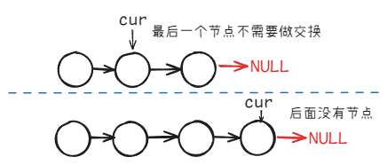

在交换节点的过程中，画出图会更好地理解交换的进行过程。

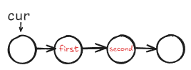

为了更清晰的表达交换的过程，我们把要交换的两个节点分别记为 `first` 和 `second`，此时 `cur` 指向的应该是 `first`，交换的过程如下： 
1. 将 `first->next` 指向 `second->next`

    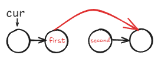

2. 将 `second->next` 指向 `first`

    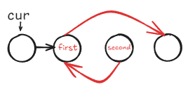

3. 将 `cur->next` 指向 `second`

    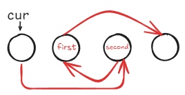

4. 交换完成，将 `cur` 指向 `first`

    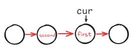

```cpp
ListNode* swapPairs(ListNode* head) {
    if (!head || !head->next) return head;

    ListNode *dummyhead = new ListNode(0, head);
    ListNode *cur = dummyhead; // 创建虚拟头节点，避免对头节点做特殊处理。

    while (cur->next && cur->next->next) {
        ListNode *first = cur->next; // 交换的第一个节点
        ListNode *second = cur->next->next; // 交换的第二个节点
        // 交换节点
        first->next = second->next; // 步骤1
        second->next = first; // 步骤2
        cur->next = second; // 步骤3
        cur = first;// 步骤4，将cur移到下一次要交换的节点前
    }
    ListNode *ans = dummyhead->next;
    delete dummyhead;
    return ans;
}
```
在不清楚的地方，把图画一下就很好理解了。

### 2. **递归的实现**
这里也可以使用递归的方法来来实现，这里我们递归交换后续节点，并将其连接到 `head` 的后面
```cpp
ListNode* swapPairs(ListNode* head) {
    //递归终止条件
    if (!head || !head->next) return head;
    //单层递归逻辑
    ListNode *newhead = head->next; // // 交换后的新头节点
    ListNode *remaining = head->next->next; // 剩余未交换部分

    head->next = swapPairs(remaining); // 递归交换后续节点，并让head连接到交换后的新链表
    newhead->next = head; // 交换当前两个节点

    return newhead; // 返回新的头节点
}  
```

该递归逻辑如下:
```cpp
// 初始链表: 1 -> 2 -> 3 -> 4
swapPairs(1)

// 递归调用：
swapPairs(1)
    ├── swapPairs(3)
    │    ├── swapPairs(NULL) → 直接返回 3
    │    ├── 交换 3 和 4 → 返回 4 -> 3
    ├── 交换 1 和 2 → 返回 2 -> 1 -> 4 -> 3
```

## 删除链表的倒数第N个节点

[19. 删除链表的倒数第 N 个结点](https://leetcode-cn.com/problems/remove-nth-node-from-end-of-list/description/)

这一题其实还是有点印象的，那就是使用双指针的思路，不过还需要注意使用头节点。

:::tip[快慢指针的用法]
定义两个指针，先让 `fast` 提前走n步，然后再两个指针一起走，直到 `fast->next` 为空，那么此时 `slow` 一定**指向要删除节点的上一个节点**，也就是**目标节点的前驱节点**。
:::

1. 先提前让`fast`往前走n步

    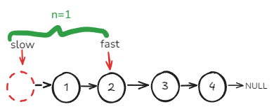

2. 直到 `fast->next` 为空，那么此时 `slow` 就是要删除节点的前驱节点。

    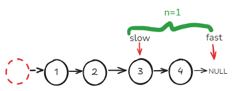

```
假设链表为：
1 -> 2 -> 3 -> 4 

n = 1
```

整体代码如下：
```cpp
ListNode* removeNthFromEnd(ListNode* head, int n) {
    ListNode *dummyhead = new ListNode(0, head); // 创建虚拟头节点
    ListNode *fast = dummyhead; //定义快慢指针
    ListNode *slow = dummyhead;

    while (n-- && fast) { //先让fast走n步
        fast = fast->next;
    }
    while (fast->next) { // 当fast的下一个节点为空时，slow找到要删除节点的前一个节点
        fast = fast->next;
        slow = slow->next;
    }
    // 基本操作
    ListNode *temp = slow->next;
    slow->next = slow->next->next;
    delete temp;
    ListNode *ans = dummyhead->next;
    delete dummyhead;
    return ans;
    }
```
这里要注意的问题就是对于要删除的节点，要操作的一定是该节点的前驱节点。

## 链表相交

[160. 相交链表](https://leetcode-cn.com/problems/intersection-of-two-linked-lists/description/)

### 1. **哈希表方法**
首先最直观的一个想法是使用哈希表

我们先遍历链表 `A`, 将 `A` 中的元素记录到哈希表中，然后再遍历链表 `B`，如果在哈希表中找到了相同的节点，那么这个节点就是相交的节点。

```cpp
ListNode *getIntersectionNode(ListNode *headA, ListNode *headB) {
    // 使用哈希表的方法
    // 时间复杂度：O(n+m)，其中 n 和 m 分别为两个链表的长度。
    // 空间复杂度：O(n)，其中 n 是链表 A 的长度。
    unordered_set<ListNode*> set;
    while (headA) {
        set.insert(headA);
        headA = headA->next;
    }
    while (headB) {
        if (set.find(headB) != set.end()) {
            return headB;
        }
        headB = headB->next;
    }
    return nullptr;
}
```
### 2. **随想录中的解法**

我们可以分别求出两个链表的长度，然后让较长的链表先走 `lenA - lenB` 步，然后两个链表一起走，直到找到相交的节点。

因为从短的链表开始出发，如果两个链表相交，那么就会存在一个相同的节点，使得两个链表同时到达。
```cpp
ListNode *getIntersectionNode(ListNode *headA, ListNode *headB) {
    // 随想录中的方法
    int lenA = 0, lenB = 0;
    ListNode *cur = headA;
    while (cur) { // A的长度
        cur = cur->next;
        lenA++;
    }
    cur = headB;
    while (cur) { // B的长度
        cur = cur->next;
        lenB++;
    }
    ListNode *longL;
    ListNode *shortL;
    if (lenA >= lenB) { // 依照长度定义长链表和短链表
        longL = headA;
        shortL = headB;
    }
    else {
        longL = headB;
        shortL = headA;
    }
    int gap = abs(lenA - lenB); 
    while (gap--) { // 长链表先走gap步
        longL = longL->next;
    }

    while(longL && shortL) {
        if (longL == shortL) return longL; // 注意是指针相等而不是值相等
        longL = longL->next;
        shortL = shortL->next;
    }
    return NULL;
}
```
这里需要注意的就是在判断相交的时候一定是判断指针相等而不是值相等。

### 3. **双指针法**

双指针的思路，使用两个指针 p1 和 p2 分别遍历两个链表：

1. `p1` 从 `headA` 开始，`p2` 从 `headB` 开始。
2. 当 `p1` 走到 `nullptr`，则跳到 `headB` 继续走；
3. 当 `p2` 走到 `nullptr`，则跳到 `headA` 继续走。
4. 如果两个链表相交，最终 `p1` 和 `p2` 会在相交点相遇。
5. 如果没有相交，最终 `p1 == p2 == nullptr`，返回 `nullptr`。

```cpp
ListNode *getIntersectionNode(ListNode *headA, ListNode *headB) {
    if (!headA || !headB) return nullptr; // 如果有空链表，则不可能相交
    ListNode *p1 = headA, *p2 = headB;
    while (p1 != p2) {  
        // p1 走完 A 就去 B，p2 走完 B 就去 A
        p1 = (p1 == nullptr) ? headB : p1->next;
        p2 = (p2 == nullptr) ? headA : p2->next;
    }
    return p1; // 如果相交，p1 == p2（相交点）；如果无交点，p1 == nullptr
}
```

对比哈希表方法，可以做到 `O(1)` 的空间复杂度，而哈希表的空间复杂度为 `O(n)`。

下面可以说明一下为什么这种方法可以找到相交的节点：

1. 两个指针最终都会走 A + B 的步数
    - 假设：headA 长度 n，headB 长度 m，相交点前分别是 a 和 b（相交部分长度 c）。
    - p1 走 A → B，共走 a + c + b 步。
    - p2 走 B → A，共走 b + c + a 步。
    - 最终，两者都会在相交点相遇，或者都变成 nullptr（无交点）。

2. 如果没有交点
    - p1 和 p2 都会走 n + m 步，最终都等于 nullptr，所以返回 nullptr。

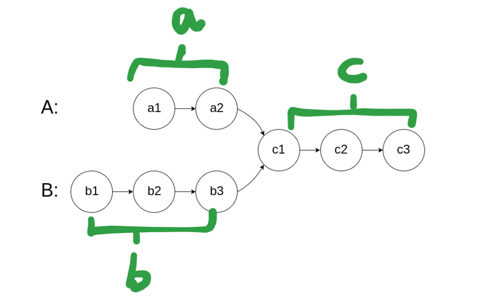

核心思路在于两个指针 `p1` 和 `p2` 走相同的距离，既然两个指针都走了相同的距离，那么他们最终一定会在相交的节点相遇。

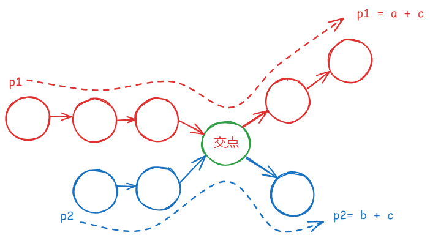

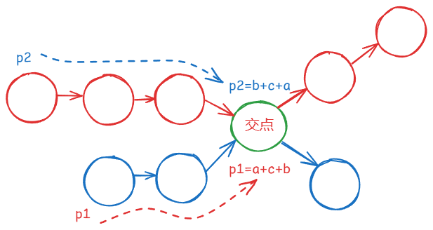


## 环形链表II

[142. 环形链表 II](https://leetcode-cn.com/problems/linked-list-cycle-ii/description/)

对于这一题，与其说是算法题，其实多少还设计到一些数学知识。

解决这个问题，我们需要拆分成两个步骤。

### 1. **如何确定有环**

搜了一下，这个其实有个专有名词，叫**Floyd 判圈法**。

:::tip[Floyd 判圈法]
Floyd 判圈法（Floyd’s Cycle Detection Algorithm）是一种 使用快慢指针判断链表是否有环 的算法，也叫 龟兔赛跑算法（Tortoise and Hare Algorithm）。
:::

可以使用快慢指针法，分别定义 `fast` 和 `slow` 指针，从头结点出发，`fast`指针每次移动两个节点，`slow`指针每次移动一个节点，如果 `fast` 和 `slow`指针在途中相遇 ，说明这个链表有环。

- 快指针 fast 每次走 2 步，慢指针 slow 每次走 1 步。
- 如果 fast 和 slow 相遇，则链表有环。
- 如果 fast 走到 nullptr，说明链表无环。

因为fast是走两步，slow是走一步，其实相对于slow来说，fast是一个节点一个节点的靠近slow的，所以fast一定可以和slow重合。

动画演示如下[^1]：


[^1]: [代码随想录-环形链表II](https://programmercarl.com/0142.%E7%8E%AF%E5%BD%A2%E9%93%BE%E8%A1%A8II.html#%E6%80%9D%E8%B7%AF)

这里还有一个明确的地方：慢指针和快指针的相遇，一定是在**第一圈**内。

### 2. **如何确定环的入口（Floyd 判圈法）**

假设：

- head → 环入口 的距离为 `a`
- 环入口 → 相遇点 的距离为 `b`
- 环的总长度为 `c`

当快慢指针相遇时：

- 慢指针 走的路程：`a + b`
- 快指针 走的路程：`a + b + k * c`（比 `slow` 多走 `k` 圈环）
- 由于 `fast` 每次走 2 步，`slow` 走 1 步，因此：

$$
2(a + b) = a + b + k \cdot c
$$

化简可以得到：

$$
a + b = k \cdot c
$$

说明 从 `head` 走 `a` 步，等价于从相遇点继续走 `c - b` 步到达环入口（也就是要求的 `x` 距离），也就是图中黄色区域的距离。

也就是说让 `slow` 从 `head` 出发，`fast` 从相遇点出发，每次走一步，最终相遇的点就是环的入口。

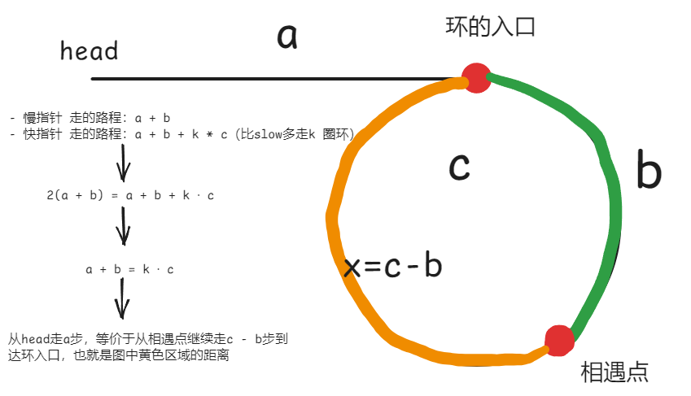


整体代码：

```cpp
ListNode *detectCycle(ListNode *head) {
    if (!head) return nullptr;
    ListNode *fast = head; // 定义快慢指针
    ListNode *slow = head;

    while (fast && fast->next) { // 因为要访问fast->next->next所以这里也不能为空
        fast = fast->next->next; // fast一次走2
        slow = slow->next; // slow一次走1

        if (slow == fast) { // 当slow和fast相等的时候说明相遇了
            ListNode *index1 = slow; // 此时一个指针从slow/fast出发，另一个从head出发
            ListNode *index2 = head;

            while (index1 != index2) { // 当index1==index2时，说明找到了入口
                index1 = index1->next;
                index2 = index2->next;
            }
            return index1;
        }
    }
    return nullptr;
}
```

## 总结

今天的内容还算比较多，其实大部分的时间还是用来写文档了，全文也并没有照抄随想录，因为想着留给自己一些更深的印象。

虽然有些内容是问了问gpt贴了过来，大AI时代嘛，当然在背后也是有自己好好去理解这些内容的。我觉得不失为一种有效的学习方式。
