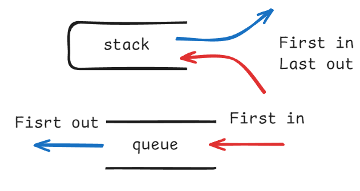

## 栈，队列

已经知道的是栈是一种后进先出（LIFO）的数据结构，而队列是一种先进先出（FIFO）的数据结构。



不过在C++中，栈和队列的实现都是一种**容器适配器(Container Adapte)**，而非容器。容器适配器是对已有容器（比如 `deque` 或 `vector`）的一种封装，用来提供不同的接口和使用方式。

:::tip[容器和容器适配器]
在 STL 中，容器分为两类：

1. 标准容器（Standard Containers）

- 如：`vector`、`deque`、`list`、`set`、`map`、`unordered_map` 等。
- 这些容器拥有完整的接口，比如随机访问、插入、删除等。

2. 容器适配器（Container Adapters）

- 如：stack、queue、priority_queue
- 它们是对标准容器的一种“限制使用接口的包装器”，让容器只能以特定的方式使用。
- 例如：
    - `stack` 能后进先出（LIFO）
    - `queue` 先进先出（FIFO）
    - `priority_queue` 最大堆（默认）
:::

容器适配器内部使用一个标准容器作为基础，比如 `deque` 或 `vector`，但不暴露全部接口，而是提供受限制的操作方式。在C++中，栈的默认底层实现是 `deque`。

```cpp
#include <stack>

std::stack<int> stk1;                // 默认底层容器是 deque
std::stack<int, std::vector<int>> stk2; // 指定使用 vector 作为底层容器

// 无法对 stack 做 begin() 或 end()，因为这些操作在适配器中被屏蔽了
```

## 用栈实现队列

[232.用栈实现队列](https://leetcode-cn.com/problems/implement-queue-using-stacks/)

如果只使用一个栈，是无法做到模拟队列的先进先出的，但如果使用两个栈，一个用来入栈，一个用来出栈，就可以实现模拟队列的先进先出。

```cpp
class MyQueue {
public:
    stack<int> stk_in;
    stack<int> stk_out;

    MyQueue() {
 
    }
    
    void push(int x) {
        stk_in.push(x); // 直接push进stk_in中
    }
    
    int pop() {
        if (stk_out.empty()) { 
            // 首先需要判断stk_out中是否有元素，如果没有则需要把stk_in中的元素全部放入stk_out中
            // 否则直接弹出stk_out栈顶元素
            while (!stk_in.empty()) { // stk_out入栈是一个持续的过程
                stk_out.push(stk_in.top());
                stk_in.pop();
            }
        }
        int result = stk_out.top();
        stk_out.pop();
        return result;
    }
    
    int peek() {
        int result = this->pop(); // 复用pop()方法，弹出栈顶元素
        stk_out.push(result); // 使用pop()方法将stk_out栈顶弹出，还要再push回去
        return result;
    }
    
    bool empty() {
        return stk_in.empty() && stk_out.empty();
    }
};
```
:::tip[关于 `peek()` 方法]
根据之前写python的经验，python中的 `pop()` 方法不仅会弹出栈顶元素，还会返回这个元素，而C++中的 `pop()` 方法只会弹出栈顶元素，不会返回这个元素。所以在 `peek()` 方法中，需要调用 `pop()` 方法，再将弹出的元素 `push()` 回去。
:::

## 用队列实现栈

[225. 用队列实现栈](https://leetcode-cn.com/problems/implement-stack-using-queues/)

### 使用两个队列来实现栈

这里我们可以沿用上面的思路，用两个队列来模拟栈的实现（其实也是题中的要求使用两个队列）。

这里的主要思路是，用两个队列 `q1` 和 `q2`，`q1` 用来存储栈中的元素，`q2` 用来辅助操作。
并且很重要的一点是，要保证 `q1.fornt()` 一定是栈顶元素。

```cpp
class MyStack { // 使用两个队列来实现栈
public:
    queue<int> q1; // q1 主栈
    queue<int> q2; // q2 用来临时存放q1的元素

    MyStack() {

    }
    
    void push(int x) { // 始终保证q1.front()是栈顶元素
        q2.push(x);  // 将新元素放入q2中
        while (!q1.empty()) { // 如果q1不为空，将q1中的元素放入q2中，这样保证q2.fornt()是栈顶元素
            q2.push(q1.front());
            q1.pop();
        }
        // swap q1 和 q2，使得 q1 始终是主栈
        swap(q1, q2);
    }
    
    int pop() {
        int result = q1.front(); // 因为q1.front()是栈顶元素，所以直接pop()，下一个元素自动成为栈顶元素
        q1.pop();
        return result;
    }
    
    int top() {
        return q1.front(); // 同pop()
    }
    
    bool empty() { // 只需返回q1是否为空即可
        return q1.empty();
    }
};
```

这里我们只使用其中一个队列来维护栈顶元素，始终保持 `q1` 的前端是栈顶元素。

### 仅使用一个队列来实现栈

这里的思路其实和上面是一样的，我们只需要在 `push()` 的时候，把新元素插入队尾，然后把前面的所有元素都重新入队，这样新元素就变成队首了。
```cpp
class MyStack { // 仅使用一个队列来实现栈
public:
    queue<int> q;

    MyStack() {}

    void push(int x) {
        q.push(x);
        int n = q.size(); // 这里一定要提前保存队列的大小，因为在循环中q的size是在不断改变的
        // 把前 n-1 个元素重新入队
        for (int i = 0; i < n - 1; ++i) {
            q.push(q.front());
            q.pop();
        }
    }
    // 剩余操作不变
    int pop() {
        int result = q.front();
        q.pop();
        return result;
    }

    int top() {
        return q.front();
    }

    bool empty() {
        return q.empty();
    }
};
```

与随想录中的实现不同的是，这里只需要在 `push()` 方法里实现入栈的逻辑就行了，维护队列的第一个元素始终是栈顶元素即可。

## 有效的括号

[20. 有效的括号](https://leetcode-cn.com/problems/valid-parentheses/)

括号匹配是一个使用栈来解决的经典问题，

我们可以模拟出当括号不匹配时的几种情况：
1. 当字符串遍历完了，但是栈不为空，说明还存在有未匹配的括号，返回 `false`。
2. 遍历字符串的过程中，发现栈里没有要匹配的字符，返回 `false`。
3. 遍历字符串的过程中，栈已经空了，但是还有右括号，返回 `false`。

第一种方法使用的是直接入栈左括号的方式：

```cpp
bool isPair(char a, char b) { // 定义一个判断括号是否匹配的函数
        return (a == '(' && b == ')' 
                || a == '[' && b == ']' 
                || a == '{' && b == '}');
    }

    bool isValid(string s) {
        stack<char> stk;
        int n = s.size() - 1;
        for (int i = 0; i <= n; i++) {
            if (s[i] == '(' || s[i] == '[' || s[i] == '{') {
                stk.push(s[i]);
                cout << stk.top();
            }
            else {
                if (stk.empty() || !isPair(stk.top(), s[i])) { // 如果是空栈或者不匹配，返回false
                    return false;
                }
                else { // 否则匹配，弹出栈顶元素
                    stk.pop();
                }
            }
        }
        return stk.empty();
    }
```

第二种方法使用的是直接入栈右括号的方式：

```cpp
bool isValid(string s) { // 入栈右括号的方式
    stack<char> stk;
    int n = s.size() - 1;
    for (int i = 0; i <= n; i++ ) {
        if (s[i] == '(') stk.push(')');
        else if (s[i] == '[') stk.push(']');
        else if (s[i] == '{') stk.push('}');
        // 1. 匹配到右括号，但是stk已经是空的，说明没有左括号与其匹配
        // 2. 匹配到右括号，但是s[i] != stk.top() 说明没有右括号与其匹配
        else if (stk.empty() || s[i] != stk.top()) return false;
        else stk.pop();
    }
    return stk.empty();
}
```

所以在匹配左括号的时候，右括号先入栈，就只需要比较当前元素和栈顶相不相等就可以了，比左括号先入栈代码实现要简单的多了。

## 删除字符串中的所有相邻重复项

[1047. 删除字符串中的所有相邻重复项](https://leetcode-cn.com/problems/remove-all-adjacent-duplicates-in-string/)

这题其实还算比较简单，不过因为随想录的验证码出了些问题，所以就自己写了写简单的思路。

```cpp
string removeDuplicates(string s) {
    stack<char> stk;
    int n = s.size() - 1;
    for (int i = 0; i <= n; i++) {
        if (!stk.empty() && stk.top() == s[i]) {
            stk.pop();
        }
        else stk.push(s[i]);
    }
    string ans;
    // 将stk中的元素存入ans中，这里还是倒序
    while (!stk.empty()) {
        ans += stk.top();
        stk.pop();
    }
    // 反转ans
    reverse(ans.begin(), ans.end());
    return ans;
}
```

不难理解，只要栈不为空的时候，且栈顶元素和当前元素相等，就弹出栈顶元素，否则入栈。

不过这里也只是删除相邻的重复项并不是所有重复项，切勿想得太复杂。

## 总结

不太难，[用队列实现栈](#用队列实现栈)中的这两个写法我觉得可以提一个PR，因为只要处理 `push()` 的逻辑就行了，看起来更清晰一点。
