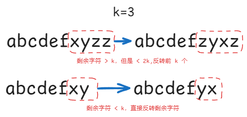

## 反转字符串

[344.反转字符串](https://leetcode-cn.com/problems/reverse-string/)

这题其实用双指针非常容易解决，但是用递归的话说实话还没有什么头绪。

双指针的解法：
```cpp
void reverseString(vector<char>& s) {
    int left = 0;
    int right = s.size() - 1;
    while (left < right) { // 当left与right相等时，说明已经遍历完了
        swap(s[left], s[right]);
        left++;
        right--;
    }
}
```

关于递归写法，我们可以使用一个辅助函数 `reverse()`,这个函数接受两个参数，一个是字符串，一个是左右指针。

递归的终止条件是 `left >= right`，说明已经遍历完了，直接返回即可。

```cpp
// 递归写法
void reverse(vector<char>& s, int left, int right) {
    if (left >= right) return; // 递归终止条件
    swap(s[left], s[right]); // 交换
    reverse(s, left + 1, right - 1); // 递归s[left + 1], s[right - 1]
}
void reverseString(vector<char>& s) {
    reverse(s, 0, s.size() - 1);
}
```

## 反转字符串II

[541.反转字符串II](https://leetcode-cn.com/problems/reverse-string-ii/)

这里的重点其实是理解题意，用不用库函数都不是重点。

我们可以画个图来帮助理解



所以可以写出以下代码：
```cpp
string reverseStr(string s, int k) {
    for (int i = 0; i < s.size(); i += 2 * k) { // i每次增加2k
        if (i + k <= s.size()) { // 如果剩余字符大于等于k个，但是小于2k个，则反转前k个字符
            reverse(s.begin() + i, s.begin() + i + k);
        } else { // 如果剩余字符小于k个，则反转所有字符
            reverse(s.begin() + i, s.end());
        }
    }
    return s;
}
```

:::tip[题外话]
其实这里的 `if (i + k <= s.size())` 也可以不写等于，直接让 `else` 去判断，虽然意思都是一样的：当剩余字符正好等于 `k` 个，反转剩余所有字符的逻辑其实是一样的。只是这种写法没有按照题意而已，依照题意还是写 `<=` 比较好。
:::

## 替换数字

[替换数字](https://kamacoder.com/problempage.php?pid=1064)

这题最直接的思路就是遍历字符串，如果是数字就替换，不是就跳过。

```cpp
# include <iostream>
# include <vector>
using namespace std;

int main() {
    string s, ans;
    cin >> s;
    for (char c : s) {
        if (c >= 'a' && c <= 'z')
        ans += c;
        else {
            ans += "number";
            continue;
        }
    }
    cout << ans;
    return 0;
}
```

其实这里也可以不使用额外空间，直接在原字符串上进行操作，但是要先将原字符串扩容。

例如 字符串 `a5b` 的长度为3，那么将数字字符变成字符串 `number` 之后的字符串为 `anumberb` 长度为 8。

然后从后向前替换数字字符，也就是双指针法，过程如下：`i` 指向新长度的末尾，`j` 指向旧长度的末尾[^1]。
[^1]: [代码随想录-替换数字](https://programmercarl.com/kamacoder/0054.%E6%9B%BF%E6%8D%A2%E6%95%B0%E5%AD%97.html#%E6%80%9D%E8%B7%AF)


从后向前填充，避免每次添加元素都要将添加元素之后的所有元素整体向后移动。

```cpp
# include <iostream>
# include <vector>
using namespace std;

int main() {
    string s;
    cin >> s;
    int count = 0;
    for (char c : s) {
        if (c >= '0' && c <= '9') count++;

    }
    int left = s.size() - 1;
    s.resize(s.size() + count * 5); // 扩容数组
    int right = s.size() - 1;
    
    while (left >= 0) { // 从后向前遍历
        if (s[left] >= '0' && s[left] <= '9') { // 遇到数字从向前填充"number"
            s[right--] = 'r';
            s[right--] = 'e';
            s[right--] = 'b';
            s[right--] = 'm';
            s[right--] = 'u';
            s[right--] = 'n';
        }
        else {
            s[right--] = s[left]; // 遇到字母直接填充
        }
        left--;
    }
    cout << s;
    return 0;
}
```

## 总结
今天的任务总的来说比较简单，没有太大难度，不过这个填充数字的在原字符串上操作的思路确实还是要多思考一会，多看几遍图解其实就也还好。

这两天估计要特别忙了，训练营说不好可能要鸽几天。