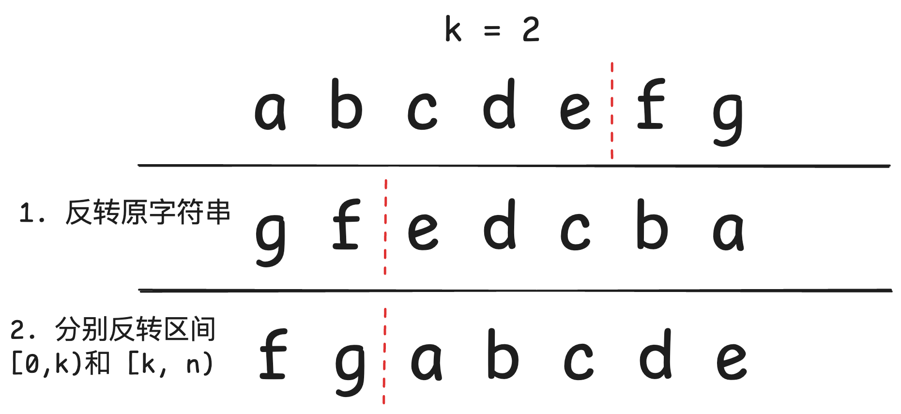

## 反转字符串中的单词

[151.反转字符串中的单词](https://leetcode-cn.com/problems/reverse-words-in-a-string/)

### 用栈实现

其实一开始想到这题的时候，用栈道思路会比较清楚，用LIFO就很好理解，不过空间复杂度为 `O(n)`

```cpp
string reverseWords(string s) {
    stack<string> st;
    string word, ans;

    //遍历字符串，按单词存入栈中
    for (int i = 0; i < s.size(); i++) {
        if (s[i] != ' ') { // 如果遇到的是字符，添加到word里
            word += s[i];
        }
        else if (!word.empty()) { //遇到空格且word为不为空，将word压入栈中
            st.push(word);
            word.clear();
        }
    }
    // 如果遍历完了，还有单词，即word不为空
    if (!word.empty()) st.push(word);
    // 从栈中弹出单词，形成结果
    while (!st.empty()) {
        ans += st.top();
        st.pop();
        if (!st.empty()) ans += " ";  // 仅在不是最后一个单词时添加空格
    }
    return ans;
}
```
时间复杂度：`O(n)`，`n` 为字符串的长度
空间复杂度：`O(n)`，最坏情况下，栈中存储了 `n` 个字符

:::important
1. 为什么要用 else if 而不是 if ：因为这里不是 default 的情况，当遇到空格时，还需要判断当前 word 是否为空
2. 在遍历结束之后，还需要再判断一次 word 是否为空，如果不为空，将 word 压入栈中：这是因为在遍历结束之后，我们可能进行了将字符添加到word中，但是最后没有遇到空格，因此我们还剩最后一个word没有入栈，所以需要单独处理一次。
3. 在出栈道过程中，如果栈为空，说明已经弹出了最后一个单词，不需要再添加空格。
:::

### 在原字符串上来实现

这题的关键问题其实在于如何去除多余的空格，要判断的情况很多，但又没有像 python 那样方便的库函数。
因此我们需要自己实现一个去除多余空格的函数。

```cpp
void removeExtraSpaces(string &s) {
    int n = s.size();
    int slow = 0, fast = 0;
    // 1. 去除字符串前面的空格
    while (fast < n && s[fast] == ' ') fast++;
    // 1.5 去除中间的空格
    while (fast < n) {
        // 2. 复制非空格字符，参考27.移除元素
        if (s[fast] != ' ') {
            s[slow++] = s[fast];
        }
        // 3.确保中间只有一个空格
        else if (slow > 0 && s[slow - 1] != ' ') { // 当slow的前一位不是空格，也就是字符的时候，才添加空格
            s[slow++] = ' ';
        }
        fast++;
    }
    // 4. 去除字符串末尾的空格
    if (slow > 0 && s[slow - 1] == ' ') slow--;
    // 5. 重新设置字符串大小
    s.resize(slow);
    cout<< s<<endl; 
}
```

在不使用库函数和辅助空间的前提下，我们可以使用两次反转来实现。
- 第一次将整个字符串反转
- 第二次将每个单词反转

因此我们整体的处理逻辑可以分以下几步：
1. 去除多余空格
2. 将整个字符串反转
3. 将每个单词反转

反转过程的如下：

```cpp
string reverseWords(string s) {
    removeExtraSpaces(s); // 去除多余空格
    reverse(s.begin(), s.end()); // 反转整个字符串

    int start = 0; // 定义一个start指向单词的起始位置
    for (int i = 0; i <= s.size(); i++){
        if ( i == s.size() || s[i] == ' ') { // 遇到字符串结束或者当前字符为空格
            reverse(s.begin() + start, s.begin() + i); // 反转区间[s.begin() + start, s.begin() + i]
            start = i + 1; // start 移动到下一位
        }
    }
    return s;
    }
```

：：：tip
复杂的其实是空格的处理逻辑。
：：：

## 右旋字符串

[右旋字符串](https://kamacoder.com/problempage.php?pid=1065)

这个其实用pyhton来做就非常简单了，伟大
```python
return s[-k:] + s[:-k]
```

C++没有类似python的切片操作，不过根据[反转字符串中单词](#反转字符串中的单词)的思路，我们也可以使用两次反转字符串来实现。

图示如下：



```cpp
# include <iostream>
# include <string>
using namespace std;

void reverse(string& s, int begin, int end) {
    while (begin < end) {
        swap(s[begin], s[end]);
        begin++;
        end--;
    }
}

int main() {
    int k;
    cin >> k;

    string s;
    cin >> s;

    if (s.size() <= 1) {
        cout << s;
        return 0;
    }
    reverse(s, 0, s.size() - 1);
    reverse(s, 0, k - 1);
    reverse(s, k, s.size() - 1);

    cout << s << endl;
    return 0;
}
```
## 总结

双指针法在数组，字符串，链表中很常用，需要熟练掌握。

在反转数组中，还是要提高自己的逻辑理解能力，反转很容易，但是各种处理的逻辑却很复杂。

今天本来应该还有个KMP算法，但是内容有些多，KMP又比较复杂，今天这里先鸽一会。